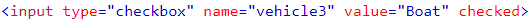

There are usually three main reasons to create a custom `PageElement` class:

- Mapping a website component which is composed of smaller components
- Implementing the abstract `ValuePageElement` class for setting and getting values
- Overwriting a base class method

Let's have a look at each of them!

## Creating a "Composed" PageElement

### Writing the Composed Element Class

Writing a "composed" `PageElement` only requires 3 steps:

- Extending the class `PageElement`
- Defining the interface for the `opts` parameter of your class' constructor
- Adding the child page nodes to your class

The `FeedItem` class located in the folder `src/page_objects/page_elements/FeedItem.ts` is a good example for a
"composed" `PageElement`. It consists of two child page nodes: a `title` and a `description`.

```typescript
import { PageNodeStore } from '../stores';
import { IPageElementOpts, PageElement } from './PageElement';

export interface IFeedItemOpts<
 Store extends PageNodeStore
> extends IPageElementOpts<Store> {}

export class FeedItem<
  Store extends PageNodeStore
> extends PageElement<Store> {

  constructor(selector: string, opts: IFeedItemOpts<Store>) {
    super(selector, opts);
  }

  get title() {
    return this.$.Element(
      xpath('//div').classContains('Feed-itemName')
    );
  }

  get description() {
    return this.$.Element(
      xpath('//div').classContains('Feed-itemDesc')
    );
  }
}
```

Please notice that defining an interface for your custom `opts` parameter, even though it does not differ from
`IPageElementOpts`, is a good practice because it makes future additions to the interface a lot easier.

### Adding an Export Entry to Index.ts

Do not forget to add an export entry for your custom page element to the `index.ts` file
located in the `src/page_objects/page_elements` folder:

```typescript
export * from './FeedItem';
```

We will need this export entry to import our class type and its `opts` interface from
a `PageNodeStore`.

## Extending ValuePageElement

As soon as you want to test forms with wdio-workflo, you will need to create custom `PageElement` classes that can
set and retrieve values from HTML elements like `<input>`. For this scenario, wdio-workflo provides an abstract
`ValuePageElement` class, a child class of `PageElement`, that you can implement.

Let's take a look at the `Input` class located at `src/page_objects/page_elements/Input.ts`:

```typescript
import { PageNodeStore } from '../stores';
import {
  IValuePageElementOpts,
  ValuePageElement,
  ValuePageElementCurrently
} from './ValuePageElement';

export interface IInputOpts<
 Store extends PageNodeStore
> extends IValuePageElementOpts<Store> {}

export class Input<
  Store extends PageNodeStore
> extends ValuePageElement<Store, string> {

  readonly currently: InputCurrently<Store, this> = new InputCurrently(this);

  constructor(selector: string, opts: IInputOpts<Store>) {
    super(selector, opts);
  }

  setValue(value: string): this {
    this.element.setValue(value);

    return this;
  }
}

export class InputCurrently<
  Store extends PageNodeStore,
  PageElementType extends Input<Store>
> extends ValuePageElementCurrently<Store, PageElementType, string> {

  getValue(): string {
    return this.element.getValue();
  }
}
```

### Defining the type of `value`

If we extend `ValuePageElement` instead of `PageElement`, we need to provide a second type parameter as well:
the type of the `value` passed to the `setValue` method and retrieved by calling `getValue()`.

For our `Input` class, we use `string` as the type of our `value` parameter.

### Implementing `setValue` and `getValue`

#### Action Methods vs. State Retrieval Methods

Our super class `ValuePageElement` requires us to implement two methods: `setValue` and `getValue`.

Before we do so, we should remember that `setValue` and `getValue` fall into two different method categories:

- `setValue` is an **"action"** method
- `getValue` is a **"state retrieval"** method

In our [Guide about PageElements](element.md), we defined that "actions" should perform an implicit wait before the
actual interaction with the page takes place. They are always defined on the `PageElement` class itself.

"State retrieval" functions, on the other hand, can be defined on both the `PageElement` class itself or inside the
`PageElementCurrently` class. If defined on the `PageElement` class, "state retrieval" methods should also perform an implicit wait.
If defined on the `PageElementCurrently` class, they should return the current state of the application's GUI immediatly.

Luckily, we only need to implement `getValue` in our `InputCurrently` class because the `Input.getValue` method
internally invokes `InputCurrently.getValue` after performing an implicit wait.

#### Invoking the Implicit Wait

But where do we ever invoke the implicit wait in our `Input.setValue` implementation?

This happens automatically when calling `this.element` inside our `Input` class. Internally, `this.element` invokes
`this._initialWait` which waits for the wait condition (eg. `visible`) of `PageElement` to be met.

If we did not have to access `this.element`, we could have also invoked `this._initialWait` directly.

Be aware, though, that `this.element` only performs an implicit wait if called from inside a `PageElement` class.
If you call `this.element` from inside a `PageElementCurrently` class like `InputCurrently.getValue` does,
no implicit wait will be performed.

### Setting the `currently` API accessor

We must not forget to set the `.currently` API accessor of our `Input` class. Otherwise, the implementation of
`InputCurrently.getValue` will not be available to `Input`.
For some strange reason, typescript (v3.4.5) is not able to infer the type of our `currently` class member when we assign an instance of `InputCurrently` to it. Therefore, we need to explicitly
define the types of `currently`, `wait` and `eventually` whenever we overwrite them:

```typescript
export class Input<
  Store extends PageNodeStore
> extends ValuePageElement<Store, string> {
  // We need to explicitly set the type of `currently` to `InputCurrently`.
  readonly currently: InputCurrently<Store, this> = new InputCurrently(this);

  /*...*/

  // If we forget to explicitly set the type of `currently`, TypeScript thinks it's `any`.
  readonly currently = new InputCurrently(this);
}
```

When defining a `PageElementCurrently` (or a `PageElementWait` or `PageElementEventually`) class, we need to pass
a reference of the "parent" `PageElement` to the constructor because some methods of our `currently`/`wait`/`eventually`
APIs need to access properties of their "parent".

For this reason, `PageElementCurrently`, `PageElementWait` and `PageElementEventually` require an additional template type
parameter: the type of their "parent" `PageElement`. This `PageElementType` is the second template type parameter after the `Store` type.

## Overwriting a Base Class Method

Component libraries for modern web development often do not stick to HTML standards.
A dropdown, for example, is often not implemented using a `<select>` and multiple `<option>` tags, but rather with a couple of `<div>`, `<input>` and `<span>` tags.

Selenium's and wdio-workflo's methods try to stick to HTML standards. If the web application
that you want to test does not, you might need to overwrite some methods of your base `PageElement` class.

Wdio-workflo's demo website, for example, is built using Microsoft's [Office UI Fabric](https://developer.microsoft.com/en-us/fabric) react component library. To indicate wether a checkbox is ticked, this library adds the CSS class `"is-checked"` to a `<div>`:


Wdio-workflo's `PageElement` base class already ships with an implementations of the
`isChecked` and `not.isChecked` methods. However, these implementations check if an
HTML attribute named `checked` is set on an HTML element:



If you take a look at the `Checkbox` class implemented in the file `src/page_objects/page_elements/Checkbox.ts` of the wdio-workflo-example repository,
you will notice that its `CheckboxCurrently` subclass therefore overwrites the default
implementations of `isChecked` and `not.isChecked`:

```typescript
export class CheckboxCurrently<
  Store extends PageNodeStore,
  PageElementType extends Checkbox<Store>
> extends ValuePageElementCurrently<Store, PageElementType, boolean> {

  getValue() {
    return this.not.isChecked();
  }

  isChecked() {
    return this.containsClass('is-checked');
  }

  get not() {
    return {
      ...super.not,
      isChecked: () => {
        // we use an arrow function so that `this` is CheckboxCurrently instead of the `not` object
        return this.not.containsClass('is-checked');
      }
    };
  }
}
```

I think the code for the `isChecked` method is pretty self-explanatory. The `not.isChecked` requires us to overwrite a method inside the `not` object which requires a little more effort
for the first overwritten method. However, the steps are always the same:

- We declare a `not` getter in our class
- We return an object including all method implementations of our base `not` object (`...super.not`)
- We overwrite `not` methods using arrow functions, so `this` will be the class rather than the `not` object

### Implementing new State Getter/Checker Methods

In our `Checkbox` example, we only needed to overwrite the `isChecked` and `not.isChecked`
implementations of the `CheckboxCurrently` subclass. Similar API functions like
`wait.isChecked` or `eventually.isChecked` will also work with our overwritten behavior
out-of-the-box because they internally invoke `currently.isChecked`.

If you want to add completely new state getter or checker methods, like `hasType` / `containsType` / `hasAnyType` to check
the HTML `type` attribute, you need to implement a couple more methods:

- `currently.hasType` / `currently.containsType` / `currently.hasAnyType`
- `currently.not.hasType`  / `currently.containsType` / `currently.hasAnyType`
- `wait.hasType`
- `wait.not.hasType`
- `eventually.hasType`
- `eventually.not.hasType`
- and maybe also a `currently.getType` and a `.getType` method on the page element class itself

You probably won't need to add completely new state getter or checker methods often,
therefore I will not add code examples in this guide. However, you can find these method implementations in the `PageElement` class located in the file `src/page_objects/page_elements/PageElement.ts` of the wdio-workflo-example repository.

For even more code examples for state getter and state checker methods,
take a look at the framework's core `PageElement` class implemented in the file `src/page_objects/page_elements/PageElement.ts` of the wdio-workflo repository.

## Adding a Factory Method to a `PageNodeStore`

After creating a custom `PageElement` class, we have to add a factory method to a `PageNodeStore` so that our new
`PageElement` class can be instantiated properly.

A factory method always receives two parameters:

- The XPath selector for the `PageNode` (`Workflo.XPath` is a `string` or an `XPathBuilder` instance)
- A subset of all properties of the `PageNode`'s `opts` parameter which can be configured "publically"

The factory method for our `Input` class can be found inside the `PageNodeStore` class located at `src/page_objects/stores/PageNodeStore.ts`:

```typescript
Input(
  selector: Workflo.XPath,
  opts?: Pick<IInputOpts<this>, Workflo.Store.BaseKeys>,
) {
  return this._getElement<Input<this>, IInputOpts<this>>(
    selector,
    Input,
    {
      store: this,
      ...opts,
    },
  );
}
```
### Picking public `opts` properties

In our example, `IInputOpts` has three properties (all inherited from `IPageElementOpts`):

- The `waitType` used to determine if a `PageElement`'s implicit waiting condition is met (eg. `visible`)
- The default `timeout` used by all implicit and explicit wait methods of a `PageElement`
- `store` - an instance of a `PageNodeStore` associated with the `PageElement`

Usually, not all of these properties should be configurable publically.
For example, the `store` associated with the `PageElement` is always set by `PageNodeStore` internally.

Therefore, we can make use of TypeScript's `Pick` keyword to only select `waitType` and `timeout` as publically
configurable properties of the `PageNode`'s `opts`. To save us some paperwork, these two very common properties are
stored in the type alias `Workflo.Store.BaseKeys`.

### Creating an instance of PageElement

All that is left now is to create an instance of our `Input` class. `PageNodeStore` provides the following methods
for creating instances of our 4 basic `PageNode` classes:

- `_getElement`
- `_getList`
- `_getMap`
- `_getGroup`

For our `Input` class, we use `_getElement` which has two template type parameters

- The type of our `PageElement` class (`Input<this>`)
- The type of the `opts` parameter of our class (`IInputOpts<this>`)

and three function parameters

- The XPath selector for our `PageElement` class
- The class itself (which derives from `PageElement`)
- The "full" `opts` parameter (merging the publically and internally configured properties)

### Invoking the new Factory Method

That's it. We should now be able to invoke our new factory method to fetch an instance of our `Input` class:

```typescript
import { stores } from `?/page_objects`;

stores.pageNode.Input(
  xpath('//input')
)
```
