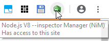
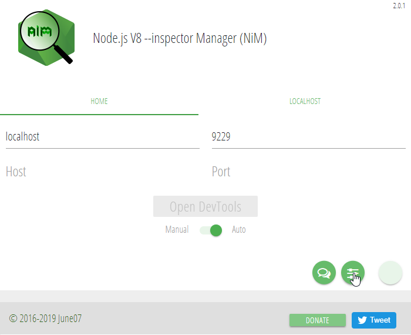
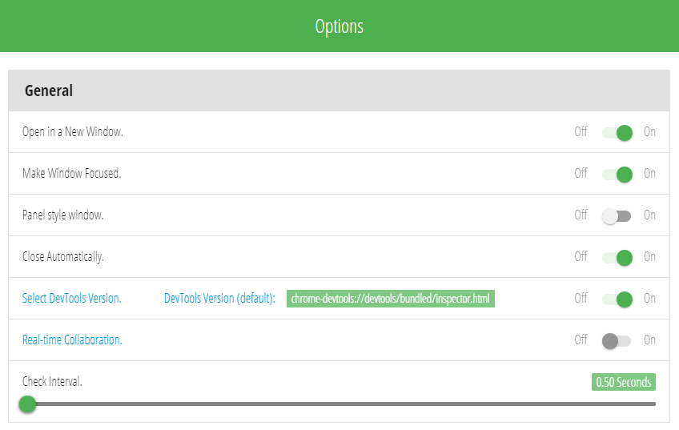

If you want to debug your tests, you can choose from two available options:

- Webdriverio's `browser.debug()` command
- Debugging in Chrome DevTools

## Webdriverio's `browser.debug()` command
If you simply want to inspect the current state of the browser window in which your tests are executed,
you can put the `browser.debug()` command somewhere inside a testcase or step.

This will pause your tests and your commandline interface will switch into a REPL mode that allows you to interact with the tested application via webdriverio commands.

Running the command `.exit` in your CLI will exit the breakpoint and continue the test run.

## Debugging in Chrome DevTools

### Preconditions

The following preconditions need to be met if you want to debug your tests using the Chrome DevTools:

- Google's Chrome browser needs to be installed on your system
- The Chrome extension "NIM (Node-Inspector Manager)" needs to be added
- You need to open a browser window in Chrome before you start your tests (so that Node-Inspector Manager can hook itself into Chrome DevTools)
- The "NIM" extension needs to be configured correctly (see below for recommended settings)

Click on the "NIM" icon in your Chrome browser's toolbar to open the NIM menu:

Now set the your host to "localhost", your port to "9229" and the mode to "Auto":

Now hover over the circle in the right bottom of the NIM menu to show the "NIM options"
button (the one that looks like sliders) and click on it.

In the NIM options, choose the following settings:

### Running your tests in debug mode

In order to use Chrome's DevTools for debugging, you need to either set the `debug` property in `workflo.conf.ts` to `true`
or invoke your tests with the `--debug` cli option enabled (`./node_modules/.bin/wdio-workflo --debug`).

Now placing a `debugger` statement somewhere in your code will pause your tests and enter a breakpoint in Chrome DevTools.
You can switch to the Chrome DevTools window and step through your test code to observe the state of variables or you can switch to the browser window in which your tests are run and inspect the state of the tested application.

When your tests are finished, the Chrome DevTools window should close automatically.

*Sometimes tests might get stuck after entering a `debugger` statement. In this case, closing all Chrome processes,
opening a new Chrome window, switching "Open DevTools" in NIM's Main Menu to "Manual" and then back to "Auto" and finally restarting your tests should resolve the problem.*