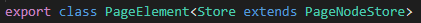
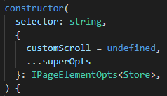

*This guide provides a detailed explanation of wdio-workflo's `PageElement` and
`ValuePageElement` classes. However, it does not show you how to customize these
classes. If you want to learn how to create your own, customized page element classes
by extending wdio-workflo's `PageElement` or `ValuePageElement` class, read the
[Customizing an Element](customElement.md) guide.*

## Overview and Objective

Wdio-workflo's `PageElement` class is the main building block of the [Page Objects](pageObjects.md)
class family. It maps a single HTML element of a website and provides methods to interact
with this HTML element and read its state. To locate the mapped HTML element on a website,
`PageElement` makes use of [XPath selectors](xpathBuilder.md).

`PageElement` implements an implicit waiting mechanism that automatically performs an
initial waiting condition before interacting with the mapped HTML element or reading its state.
In addition, `PageElement` also provides the `currently` API to check or read the current state
of the mapped HTML without waiting as well as the `wait` and `eventually` APIs to either wait
for the HTML element's state to meet a certain condition or to check if the HTML element's state
does eventually meet a certain condition.

An important derivation of the `PageElement` class is wdio-workflo's `ValuePageElement`
class that provides two additional methods, `getValue` and `setValue`, to manage the value
of components like inputs, checkboxes or dropdowns.

## Creating a `PageElement`

Instead of manually invoking the constructor of `PageElement` using the `new` keyword,
you should always call the `Element()` factory method of the [PageNodeStore](store.md)
class to create an instance of the `PageElement` class:

```typescript
import { stores } from '?/page_objects';

// create PageElement instances by calling the `Element()` factory method of a PageNodeStore
const myElement = store.pageNode.Element('//div');
```

However, for the sake of completeness, let's examine the type parameters and constructor
of `PageElement` in more detail.

The `PageElement` class requires you to define one type parameter, the type of its associated `PageNodeStore`, which can be used to create other page nodes:



The constructor of `PageElement` requires two parameters:

- The XPath selector used to located the mapped HTML element on the website
- The `opts` parameter containing properties to configure the `PageElement`



## The Associated `PageNodeStore`

Each `PageElement` stores an instance of a `PageNodeStore` in its private `_store`
class member variable.

If you extend the `PageElement` class to create a custom page element which maps a composite website component that consists of several different HTML elements, you can use
the `PageNodeStore` instance stored inside `_store` to create page nodes
which map these other HTML elements.

Furthermore, `PageElement` provides a public `$` accessor that also refers
to the `PageNodeStore` instance associated with the `PageElement`. The `$` accessor
additionally prepends the XPath selector of its `PageElement` to the XPath selector
passed to the factory methods of the associated `PageNodeStore`:

```typescript
import { stores } from '?/page_objects';

// myContainer has the XPath selector '//div'
const myContainer = stores.pageNode.Element('//div');

// myButton has the combined XPath selector '//div//button'
const myButton = myContainer.$.Element('//button');
```

## The `getSelector()` Method

As already mentioned, `PageElement` uses an XPath selector to located its mapped
HTML element on the website.

You can retrieve the XPath selector of a `PageElement` by calling its `getSelector` method:

```typescript
import { stores } from '?/page_objects';

const myContainer = stores.pageNode.Element('//div');

// outputs '//div' to the console
console.log(myContainer.getSelector())
```

This can be useful if your `PageElement` can't be located on the website and
you want to debug your testcase and output the XPath selector of the affected
`PageElement`.

## The Underlying WebdriverIO Element

Wdio-workflo's `PageElement` class introduces an additional layer of abstraction
on top of WebdriverIO's [browser.element](http://v4.webdriver.io/api/protocol/element.html) method. The `browser.element` method takes an XPath selector and fetches the first HTML
element matching this selector from the website:

```typescript
browser.element('//div')
```

The `PageElement` class does not store any information about the state of its mapped HTML
element. Instead, the state retrieval methods defined on `PageElement` internally invoke [WebdriverIO commands](http://v4.webdriver.io/api.html) on the element returned by `browser.element` to read information about the state of the mapped HTML element
directly from the GUI itself.

You can access the underlying WebdriverIO element of a `PageElement` via its `element`
accessor. Before returning the WebdriverIO element, the `element` accessor
calls the `initialWait()` method of the `PageElement` class to make sure that
the HTML element is fully loaded before you try to interact with it or read its state:

```typescript
get element() {
  this.initialWait();

  return this.__element;
}

protected get __element() {
  return browser.element(this._selector);
}
```

You can learn more about the waiting mechanisms of `PageElement` in the next
section of this guide.

## Waiting Mechanisms

### Implicit Waiting

When you open a website in your browser, the website and its components are usually not available immediately. A request to load the code of the website
needs to be processed by a webserver, the server's response needs to be transferred to your browser and your browser needs to render the contents of the website before it can be displayed. Depending on the speed of your internet connection, the size of the website and the computational power of the webserver and your computer, it might take some time before you can read the contents of a
website and interact with them.

In the age of Web 2.0, asynchronous loading of website content and single page
applications further intensify this problem.

Our tests need to take these waiting times into account, otherwise we would
get a lot of errors because elements could not be located on the website since
the website has not been fully loaded yet.

To reduce the number of explicit waiting statements in your test code,
wdio-workflo implements an implicit waiting mechanism: Whenever you call a method on the `PageElement` class that reads the state of its mapped HTML element
(e.g. `getText()`) or interacts with it (e.g. `click()`), wdio-workflo automatically waits for an initial waiting condition to be fulfilled before
executing the corresponding command.

The four different kinds of initial waiting conditions are defined by the `Workflo.WaitType` enum and can be set via the `waitType` property of the page element's `opts` parameter:

- `exist` waits until the element exists on the website
- `visible` waits until the element is visible on the website (default value; not obscured by another element or hidden via CSS styles)
- `text` waits until the element has any text content
- `value` waits until the element has any value (only for `ValuePageElement` classes)

Most [factory methods](store.md#factory-methods) of a `PageNodeStore` allow you to define the value of `waitType` as property of their publicly configurable `opts` parameter:

```typescript
import { stores } from '?/page_objects';

const hiddenContainer = stores.pageNode.Element('//div', {
  waitType: Workflo.WaitType.exist
});
```

### Explicit Waiting: `currently`, `wait` and `eventually`

In addition to its implicit waiting mechanism, each page node class ships with
a `wait` API that offers you the ability to explicitly control when your tests should wait for an HTML element to reach a certain state.

Furthermore, page nodes also have a `currently` API to read or check the current state of a mapped HTML element without performing an implicit wait, and an `eventually` API that lets you check if an HTML element reaches a certain state within a specific timeout.

#### The `currently` API

The `currently` API bypasses the implicit wait usually performed when invoking
state retrieval methods of a page node class (e.g. `PageElement.getText()`).

Let's take a look at the following code example to better understand the difference between invoking a state retrieval function directly on the `PageElement` class and invoking a state retrieval function on the `currently` API of the `PageElement`:

```typescript
import { stores } from '?/page_objects';

const element = stores.pageNode.Element('//div');

// implicitly waits for the element to be visible and then returns its text
console.log( element.getText() )

// immediately returns the element's text without waiting for it to be visible
console.log( element.currently.getText() )
```

To spare you the need of first reading the current state of an HTML element and then comparing it to an expected value in a second step, the `currently` API also provides a set of functions that let you check directly if the state of an HTML element matches an expected state.

These "state check functions" usually come in three variants for each attribute
of an HTML element's state:

- `hasXXX(value)` checks if the HTML attribute XXX equals an expected value
- `containsXXX(value)` checks if the HTML attribute XXX contains an expected value
- `hasAnyXXX()` checks if the HTML attribute XXX has any value

Let's examine these three variants of `currently` state check functions by the example of an HTML element's "text" attribute:

```typescript
import { stores } from '?/page_objects';

const element = stores.pageNode.Element(
  xpath('//div').text('wdio-workflo')
);

// returns true because the actual text equals 'wdio-workflo'
element.currently.hasText('wdio-workflo')

// returns true because the actual text contains the substring 'workflo'
element.currently.containsText('workflo')

// returns true because the element has any text (it is not blank/empty)
element.currently.hasAnyText()
```

*Please note that interaction methods of a `PageElement` like `click()` and `scrollTo()` always perform an implicit wait because interacting with elements that have not been rendered yet doesn't make much sense. Therefore, the `currently` API does not contain interaction methods like `click()`.*

#### The `wait` API

The `wait` API contains a set of state check functions that wait for an HTML
element to reach a certain state within a specific timeout.

If the HTML element does not reach the expected state within the specified timeout, an error will be thrown. Otherwise, the `PageElement` instance
will be returned by each function defined on the `wait` API, so you can easily
chain additional `PageElement` method calls:

```typescript
import { stores } from '?/page_objects';

const element = stores.pageNode.Element('//div');

element.wait.hasText('wdio-workflo', {timeout: 3000}).click()
```

If you do not explicitly specify a timeout value when calling a state check function on `wait`, the default timeout of the `PageElement` will be used:

```typescript
import { stores } from '?/page_objects';

const element = stores.pageNode.Element('//div');

// uses this._timeout as timeout value
element.wait.hasText('wdio-workflo')
```

The default timeout value for a specific instance of a `PageElement` can be set by defining the `timeout` property of the publicly configurable `opts` parameter
of a [factory method](store.md#factory-methods) in milliseconds:

```typescript
import { stores } from '?/page_objects';

const element = stores.pageNode.Element('//div', {
  timeout: 10000 // 10 seconds
});
```

Alternatively, you can also define the global default timeout value that will be
used as a fallback value for all page nodes in `workflo.conf.ts`:

```typescript
export const workfloConfig: IWorkfloConfig = {
  /*...*/
  timeouts: {
    default: 6000
  }
  /*...*/
};
```

#### The `eventually` API

The `eventually` API is almost identical to the `wait` API: It also waits for an
HTML element to each a certain state within a specific timeout. However, the
state check functions defined on the `eventually` API will return `true` if the
expected state is reached within the specified timeout and `false` if it is not:

```typescript
import { stores } from '?/page_objects';

const element = stores.pageNode.Element(
  xpath('//div').text('wdio-workflo')
);

// will probably return false since the website has not finished rendering yet
element.eventually.hasText('wdio-workflo', {timeout: 1})

// will return true if the website finishes loading within 20 seconds
element.eventually.hasText('wdio-workflo', {timeout: 20000})
```

The `eventually` API does not throw an error if the HTML element fails to reach the expected state within the specified (or default) timeout.

## The `ValuePageElement` Class

Some components of a website like inputs, checkboxes, radio buttons, dropdowns, textareas
or toggles/switches manage a value that can be modified by users.

Wdio-workflo's `PageElement` class has no way of getting or setting the value of such components.
In this event, you need to make use of wdio-workflo's `ValuePageElement` class.
`ValuePageElement` is an abstract class that inherits all functionality of the `PageElement` class
and in addition provides two abstract methods, `getValue` and `setValue`, to manage the value
of components like input or checkbox.

However, since the implementation of these components can vary greatly between the different
available component libraries for React, Angular and the like, wdio-workflo does not
ship with a standard implementation for `getValue` and `setValue`.

Instead, you need to create your own, custom page element classes that inherit
from `ValuePageElement` and implement its `getValue` and `setValue` methods.

You can read more about how to do this in the [Extending `ValuePageElement`](customElement.md#extending-valuepageelement)
section of the [Customizing an Element](customElement.md) guide.