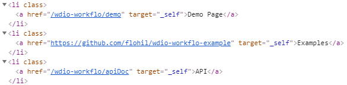

*This guide provides a detailed explanation of wdio-workflo's `PageElementList` and
`ValuePageElementList` classes. However, it does not show you how to customize these
classes. If you want to learn how to create your own, customized list classes
by extending wdio-workflo's `PageElementList` or `ValuePageElementList` class, read the
[Customizing a List](customList.md) guide.*

## Overview and Objective

Wdio-workflo's `PageElementList` manages a dynamic collection of `PageElement` instances
of the same class. Dynamic means that the contents of the collection/the individual
page elements managed by the collection are not known at compile time and can change
during runtime.

Some typical website components that should be mapped by a `PageElementList`
are a the items of a news feed and the rows of a data table, because news feed items
and the rows displayed in a data table are usually not known at
the time of test creation and can change during the runtime of your web application.

`PageElementList` provides several ways to access certain list elements, retrieve
all elements managed by the list and create sublists. It even ships with a
`where` builder that lets you query list elements by modifying their XPath selectors.

Moreover, `PageElementList` features a `currently` and an `eventually` API to
check if some, none or all of the list's elements currently/eventually have
a certain state, and a `wait` API to wait for some, none or all of the list's
elements to reach a certain state.

And finally, of course, the `PageElementList` class provides methods to read
the number of elements managed by the list and to check if the list is empty or if
the number of list elements is equal, smaller or bigger than an expected value.

## Creating a `PageElementList`

### `ElementList()` Factory Method

Instead of manually invoking the constructor of `PageElementList` using the `new` keyword,
you should always call the `ElementList()` factory method of the [PageNodeStore](store.md)
class to create an instance of the `PageElementList` class:

```typescript
import { stores } from '?/page_objects';

const linkList = stores.pageNode.ElementList('//a');
```

However, for the sake of completeness, let's examine the type parameters and constructor
of `PageElementList` in more detail!

### Type Parameters

The `PageElementList` class has three type parameters:

- The type of the `PageNodeStore` associated with the list to create other page nodes.
- The class type of the page elements managed by the list.
- The type of the `opts` parameter of a single page element managed by the list.

```typescript
export class PageElementList<
  Store extends PageNodeStore,
  PageElementType extends PageElement<Store>,
  PageElementOptions extends Partial<IPageElementOpts<Store>>,
> extends PageNode<Store>
```

### Constructor

The constructor of `PageElementList` requires two parameters:

- The XPath selector that locates all of the list's page elements on a website.
- The `opts` parameter containing properties to configure the `PageElementList`

```typescript
constructor(
  selector: string,
  opts: IPageElementListOpts<Store, PageElementType, PageElementOptions>,
) { /*...*/ }
```

The most important properties of the `opts` parameter are:

- `store` => The `PageNodeStore` instance associated with the `PageElementList`.
- `timeout` => The list's default timeout for all functions of the [`eventually` and `wait` APIs](#explicit-waiting-currently-wait-and-eventually).
- `interval` => The list's default interval for all functions of the [`eventually` and `wait` APIs](#explicit-waiting-currently-wait-and-eventually).
- `elementStoreFunc` => The factory method used to create a single list element.
- `elementOpts` => The `opts` parameter passed to `elementStoreFunc` to create a list element.

## Accessing List Elements

### `first`, `at` and `all`

#### `first`

The `first` accessor retrieves the first page element managed by a `PageElementList`:

```typescript
import { stores } from '?/page_objects';

const linkList = stores.pageNode.ElementList('//a');

linkList.first.click();
```

#### `at`

The `at` method retrieves a page element managed by a `PageElementList` at a
specific position. It takes one parameter, the index of the retrieved page element
(starting at 0):

```typescript
import { stores } from '?/page_objects';

const linkList = stores.pageNode.ElementList('//a');

linkList.at(2).click();
```

#### `all`

The `all` accessor retrieves all page elements managed by a `PageElementList` as
an array. The order of the array elements corresponds to the order in which
the corresponding HTML elements were located on the website:

```typescript
import { stores } from '?/page_objects';

const linkList = stores.pageNode.ElementList('//a');

linkList.all.forEach(
  link => link.click()
);
```

### `where` Builder

The `where` class member of `PageElementList` let's you access a slightly modified
version of wdio-workflo's [XPath builder](xpathBuilder.md) which allows you to query
for certain list elements by modifying their XPath selector.

In contrast to the original `xpath` builder, you do not need to pass an initial
XPath expression to the `where` builder. Instead, the `where` builder always
starts out with list's XPath selector (which locates all elements managed by a list)
and then uses the builder functions of the `xpath` builder to expand the list's
XPath selector and further restrict the subset of matched elements.

To learn more about available builder functions and how to apply them,
please read the [XPath builder guide](xpathBuilder.md).

Once you're finished modifying the XPath expression using builder functions,
the `where` builder offers 4 methods to retrieve the page elements matched by
the modified XPath selector:

- `getFirst()` returns the first matched page element.
- `getAt(index)` returns the n-th matched page element (index n starts at 0).
- `getAll()` returns an array of all matched page elements.
- `getList()` returns a new `PageElementList` whose XPath selector is set to the result of the `where` builder.

Below you can find some code examples demonstrating the usage of a list's `where` builder:

```typescript
import { stores } from '?/page_objects';

const linkList = stores.pageNode.ElementList('//a');

// Fetch the first element from linkList whose text equals 'Feed Page'.
// Resulting XPath: //a[.="Feed Page"]
const feedPageLink = linkList.where.text('Feed Page').getFirst();

// Fetch all elements from linkList whose class HTML attribute contains 'active'.
// Resulting XPath: //a[contains(@class, "active")]
const firstActiveLink = linkList.where.classContains('active').getAll();

// Fetch the third list element whose 'role' HTML attribute equals 'navigation'.
// Resulting XPath: (//a[@role, "navigation")])[3] => XPath index starts at 1
const thirdNavigationLink = linkList.where.attribute('role', 'navigation').at(2);

// Create a sublist with all elements of linkList that are disabled.
// The sublist will be of the same class type as the original list.
// Resulting XPath: //a[@disabled]
const disabledLinkList = linkList.where.disabled().getList();
```

### `identify` Method

The `identify()` method converts a list's array of managed page elements
into a hash data structure. The keys used to access certain page elements in the
resulting hash can be determined by any criteria you like - the only precondition
is that they have to be unique. This is useful if you want to access list elements
by other criteria than their index.

Wdio-workflo's demo website, for example, has a feed page that shows a list of animals.
Using the `identify()` method, you could make the names of the animals the keys
of the resulting hash. This would allow you to access certain animals in the
list by their name:

```typescript
import { pages } from '?/page_objects';

const animalsList = pages.feed.feedList.identify({
  identifier: {
    mappingObject: {
      cat: 'Cat',
      dog: 'Dog'
    },
    mappingFunc: element => element.getText()
  }
});

animalsList.cat.click();
animalsList.dog.click();
```

As you can see from the example above, the `identify()` method takes one object
as parameter. This object can have two properties:

- An `identifier` object.
- A `resetCache` flag.

The `identifier` object contains two properties, `mappingObject` and `mappingFunc`,
which are needed to map the list's array of page elements to the keys of the resulting hash:

The keys of the `mappingObject` also define the keys of the resulting hash.
In other words, these are the keys you can later use to access certain elements
of the list. During the conversion process, `mappingFunc` is invoked for
each of the page elements managed by the list. The result of each `mappingFunc`
invocation is then compared to the values of the `mappingObject`. If there is a match,
the page element is linked to the corresponding hash key. In order for this to work,
both the keys and the values of the `mappingObject` need to be unique.

If you don't want to pass an `identifier` object for each invocation of `identify()`,
you can also set a default `identifier` object via the [`opts` parameter](#creating-a-pageelementlist) of `PageElementList`. You will still be able to override the default `identifier` if you explicitly pass another `identifier` to an invocation of the
`identify()` method.

The mapping process of `identify()` requires all of the list's page elements
to be fetched from the website which can take some time. Therefore, `PageElementList`
caches the results of the mapping process and reuses them for later invocations
with the same `mappingObject` and `mappingFunc`. By setting the `resetCache` flag
to `true`, you can manually delete the cached mapping results and force the list
to perform a new mapping process. You should do this whenever the contents of
the list change. Alternatively, you can disable the caching of mapped results
altogether by setting the `disableCache` property of the [`opts` parameter](#creating-a-pageelementlist) of `PageElementList` to `true`.

As already mentioned, the `identify()` method can significantly increase the
execution time of a testcase. Make sure to only use it if you have to. If all
you want to do is access a certain list element, the [`where` builder](#where-builder)
of the `PageElementList` class is a much faster alternative performance-wise
because it does not have to fetch all of a list's page elements from the website
before you can access a certain page element.

### The Underlying WebdriverIO Elements

Having read about the [underlying WebdriverIO element](element.md#the-underlying-webdriverio-element)
of the `PageElement` class, you already know that each `PageElement` wraps a single
WebdriverIO element returned by the `browser.element()` function. This WebdriverIO element is accessible via the `element` and `currently.element` accessors of
`PageElement`.

To access the underlying WebdriverIO elements for all `PageElement` instances managed
by a `PageElementList`, you could iterate over the `PageElement` array returned by
`PageElementList.all` and then access the underlying WebdriverIO element for each
`PageElement` using its `element` and `currently.element` accessors.

But there is a much more elegant alternative! The `PageElementList` class
provides an `elements` accessor that returns the result of WebdriverIO's
`browser.elements()` function, which takes the list's XPath selector and fetches
all HTML elements matched by this selector from the website:

```typescript
get elements() {
  return browser.elements(this._selector);
}
```

You can then access the array of fetched WebdriverIO elements via the `value`
property of the result object returned by `browser.elements()`. Consider the
following usage example:

`PageElement` instances managed by a `PageElementList` do not provide abstraction
functions for all available WebdriverIO's commands. One command for which no abstraction function exists is `doubleClick`. So if you wanted to double click on each element of a `PageElementList`, you would need to access the WebdriverIO elements
wrapped by the list and call the `doubleClick` command on each of them:

```typescript
import { stores } from '?/page_objects';

const linkList = stores.pageNode.ElementList('//a');

// `.elements.value` returns the wrapped WebdriverIO elements which provide a `doubleClick` function.
linkList.elements.value.forEach(
  wdioElement => wdioElement.doubleClick()
)
```

## State Functions

### Reading and Checking the List Length

#### Reading the List Length

To retrieve the length of a `PageElementList` (the number of WebdriverIO elements
which match the list's XPath selector), you can call its `getLength()` and
`currently.getLength()` methods. Since the `PageElementList` class has no
implicit waiting mechanism, both of these methods return the current length
of the list. `getLength()` is just a convenience method/an alias for
`currently.getLength()`:

```typescript
import { stores } from '?/page_objects';

const linkList = stores.pageNode.ElementList('//a');

const length1 = linkList.getLength();
const length2 = linkList.currently.getLength();

// Returns `true` because `getLength()` and `currently.getLength() are the same.
length1 === length2
```

#### Checking the List Length

Using the `wait.hasLength()` method, you can wait for `PageElementList` to have
an expected length. `currently.hasLength()` allows you to check if `PageElementList`
currently has an expected length and `eventually.hasLength()` lets you check if
`PageElementList` eventually has an expected length within a specific timeout.

The `hasLength()` method always takes parameters:

- The expected length as a number.
- A comparator to compare the expected and the list's actual length. Per default,
the comparator checks if the two values are equal (`==`), but you can also use
less than (`<`), greater than (`>`) or other than (`!=`) comparisons. For the `wait`
and `eventually` APIs, the comparator is wrapped in the `opts` parameter object
as its `comparator` property. To set the comparator value, you need to use
the `Workflo.Comparator` enum.

The following code examples demonstrate the usage of the `hasLength()` function:

```typescript
import { stores } from '?/page_objects';

const linkList = stores.pageNode.ElementList('//a');

// Checks if the list currently has 5 elements.
linkList.currently.hasLength(5);

// Checks if the list currently does not have 5 elements.
// Both statements below achieve the same outcome.
linkList.currently.not.hasLength(5);
linkList.currently.hasLength(5, Workflo.Comparator.notEqualTo);

// Waits for the list to have more than 5 elements.
linkList.wait.hasLength(5, { comparator: Workflo.Comparator.greaterThan });

// Checks if the list eventually has less then 5 elements within 3 seconds.
linkList.eventually.hasLength(5, {
  comparator: Workflo.Comparator.lessThan,
  timeout: 3000
});
```

### State Retrieval Functions

State retrieval functions of the `PageElementList` class fulfil the same purpose
as those of the `PageElement` class: For each `PageElement` instance managed by the
list, they retrieve the value of a certain attribute of the HTML element that is
wrapped by `PageElement` from the website.

However, since a `PageElementList` manages a collection of `PageElement` instances,
the state retrieval functions defined on the `PageElementList` class do not return
a single attribute value, but an array of attribute values - one for each
`PageElement` instance managed by the list. The order of the returned attribute
values corresponds to the positions of their corresponding `PageElement` instances
in the list.

Let's assume our `PageElementList` manages all link `<a>` elements in the following
HTML structure:



```typescript
import { stores } from '?/page_objects';

const linkList = stores.pageNode.ElementList('//a');

// Retrieves the texts of all link elements managed by the list as a string array.
const linkTexts = linkList.getText();
```

In the above example, the `linkTexts` variable would now store
`["Demo Page", "Examples", "API"]`.

Internally, `PageElementList` simply loops over all of its managed
`PageElement` instances and invokes the respective state retrieval function
on each `PageElement`. You can also skip the invocation of the state retrieval
function for certain `PageElement` instances by using a filter mask. The
[Filter Masks section](#filter-masks) of this guide shows you how to do that.

For more information about the types of available state retrieval functions,
please read the [State Retrieval Functions section](element.md#state-retrieval-functions)
of the `PageElement` guide. Please note that not all types of `PageElement` state
retrieval functions are also available on a `PageElementList`.

### Action Functions

Action functions change the state of the tested web application by interacting
with HTML elements that are mapped by `PageElement` instances. To execute an
action function on each `PageElement` instance managed by a `PageElementList`,
you have two options:

- You can simply loop over the array of `PageElement` instances returned by the
`all` accessor of `PageElementList` and invoke an action function on each.
- You can use the `eachDo()` method of the `PageElementList` which automatically
loops over the managed `PageElement` instances and invokes an action function which
you need to pass to `eachDo()` on each page element. Using `eachDo()` allows you to
optionally pass a [filter mask](#filter-masks) as second parameter to skip the action
function's invocation for certain `PageElement` instances.

The following code example compares both options for executing action functions
on each element of a list:

```typescript
import { stores } from '?/page_objects';

const linkList = stores.pageNode.ElementList('//a');

// Clicks on each element of `linkList`.
linkList.all.forEach( element => element.click() )

// Clicks on the second element of `linkList` but skips the click for the
// first element because its corresponding filter mask value is set to `false`.
linkList.eachDo(
  element => element.click()
  [false, true]
)
```

For more information about the types of available action functions,
please read the [Action Functions section](element.md#action-functions) of the
`PageElement` guide.

### State Check Functions

The state check functions of the `PageElementList` class let you check if all
or some of the `PageElement` instances managed by a `PageElementList` currently
or eventually have an expected state. They also allow you to wait for some or all
page elements of a list to reach an expected state within a specific timeout.

If a state check function of `PageElementList` requires you to pass the expected
attribute states as a parameter, you can define this parameter in two ways:

- You can pass an array of expected attribute values. This length of this array
needs to equal the number of page elements managed by the list. The index of
a value in the array corresponds to the position of a page element in the list
(The third value in the expected attribute values array will be used to invoke
the state check function on the third page element in the list).
- You can pass a single attribute value. This value will be used to call the
state check function of each page element manged by the list.

If you set a value in the array of expected attribute values to `undefined`,
the invocation of the state check function for the corresponding page element
will be skipped.

For state check functions that do not require you to pass the expected attribute
states as a parameter, you can use a [filter mask](#filter-masks) to skip the
invocation of the state check function for certain `PageElement` instances.

The following code example demonstrates the usage of the state check functions
of a `PageElementList`:

```typescript
import { stores } from '?/page_objects';

const animalsList = stores.pageNode.ElementList(
  xpath('//div').classContains('animalName')
);

// Checks if the text of the first element is 'Cattle', the text of the second
// element is 'Cat' and the text of the third element is 'Elephant'.
animalsList.currently.hasText(['Cattle', 'Cat', 'Elephant']);

// Checks if each the text of each list element contains the letter 'a'.
animalsList.currently.containsText('a');

// Checks if the first and the third element of the list have any text (are not empty).
animalsList.currently.hasAnyText([true, false, true]);

// Waits for all elements of the list to become visible.
animalsList.wait.isVisible();

// Waits until the first and third element of the list are not/no longer visible.
animalsList.wait.not.isVisible({ filterMask: [true, false, true] });

// Checks if the text of the first element does not eventually contain the letter 'u'
// and if the text of the third element does not eventually contain the letter 'i'.
animalsList.eventually.not.containsText(['u', undefined, 'i']);
```

To find out how state check functions behave differently when invoked on the
`currently`, `wait` or `eventually` API of a `PageElementList`, please read the
corresponding sections of this guide:
[The `currently` API](#the-currently-api),
[The `wait` API](#the-wait-api),
[The `eventually` API](#the-eventually-api).

For more information about the types of available state check functions,
please read the [State Check Functions section](element.md#state-check-functions)
of the `PageElement` guide. Please note that not all types of `PageElement` state
check functions are also available on a `PageElementList`.

### Filter Masks

The `PageElementList` filter mask allows you to restrict the execution of a
state retrieval, action or state check function to certain managed `PageElement`
instances.

You can set the `PageElementList` filter mask to a boolean value or an array of
boolean values:

- If the filter mask is set to `true`, the corresponding function will be executed
for all managed `PageElement` instances of a `PageElementList`.
- If the filter mask is set to `false`, the corresponding function will be skipped
for all managed `PageElement` instances of a `PageElementList` (this can be helpful
when using a `PageElementList` inside the content of a `PageElementGroup`).
- If the filter mask is set to an array of booleans, a value of `true` means that
the function will be executed for the corresponding `PageElement` and a value of
`false` means that it will be skipped. The length of the filter mask array needs
to match the number of `PageElement` instances managed by the list.

The filter mask can be set via the last parameter of a state retrieval, action or
state check function. If such a function has other optional parameters, the filter
mask can be defined via the `filterMask` property of the `opts` parameter (which
is always the last function parameter). Otherwise, the filter mask itself represents
the last function parameter.

Here are some examples for how to use a `PageElementList` filter mask:

```typescript
import { stores } from '?/page_objects';

const linkList = stores.pageNode.ElementList('//a');

// `texts` will be an array of two strings, because the result of the second,
// skipped page element is not included in the result. `linkList` needs to
// managed three page element instances in order for this to work correctly.
const texts = linkList.getText([true, false, true]);

// Since the filter mask is set to `true`, all elements of the `linkList` will
// be clicked.
linkList.eachDo(
  element => element.click(),
  true
);

// There are other optional parameters like `timeout`, therefore the filter mask
// is defined via the `filterMask` property of the `opts` parameter.
// Since the value of the filter mask is `false`, the invocation of `hasAnyText()`
// will be skipped for all elements of `linkList`.
linkList.eventually.hasAnyText({ timeout: 3000, filterMask: false });
```

Filter masks are not available for state check functions that require you to pass
the expected attribute values as a parameter, e.g. `hasText(texts)` or
`containsValue(values)`. In these cases, you can skip the execution of the state
check function for a certain `PageElement` instance by setting its corresponding
value in the array of expected attribute values to `undefined`:

```typescript
import { stores } from '?/page_objects';

const linkList = stores.pageNode.ElementList('//a');

// The invocation of the `hasText` function for the second managed page element
// of `linkList` will be skipped. The function returns true if the text of the first
// element equals 'First Link' and the text of the third element equals 'Third Link'.
const result = linkList.currently.hasText(['First Link', undefined, 'Third Link']);
```

## Waiting Mechanisms

### Implicit Waiting

`PageElementList` does not have an implicit waiting mechanism of its own.
However, if you invoke a state retrieval or action function on a `PageElement`
instance  managed by a `PageElementList`, the
[implicit waiting mechanism of the `PageElement`](element#implicit-waiting) will be triggered.

The publicly configurable `opts` parameter of the `ElementList()` factory method
provides an `elementOpts.waitType` property which allows you to define the `waitType`
of the `PageElement` instances managed by the `PageElementList`:

```typescript
import { stores } from '?/page_objects';

const linkList = stores.pageNode.ElementList('//a', {
  elementOpts: {
    waitType: Workflo.WaitType.text
  }
});

linkList.all.forEach(
  // The `click()` action function triggers linkElement's implicit waiting mechanism.
  // So, before each click, wdio-workflo waits for the linkElement to have any text.
  linkElement => linkElement.click();
)
```

### Explicit Waiting: `currently`, `wait` and `eventually`

The explicit waiting mechanisms of `PageElementList` are very similar to the
ones used by `PageElement` and you should read about them in the
[Explicit Waiting](element.md#explicit-waiting-currently-wait-and-eventually)
section of the [`PageElement` guide](element.md) before you continue reading
this guide.

To learn how the behavior of state retrieval and state check functions of the
`PageElementList` class differs from its `PageElement` class equivalents, please
read the [State Function Types section of this guide](#state-function-types).

The types of available state retrieval and state check functions can be found
in the [State Function Types section](element.md#state-function-types) of the
page element guide. Please note that not all types of `PageElement` state
retrieval and state check functions are also available on a `PageElementList`.

### The `currently` API

#### Overview

Like the [`currently` API of `PageElement`](element.md#state-retrieval-functions-no-implicit-waiting),
the `currently` API of the `PageElementList` class consists of state retrieval functions
and state check functions. It does not trigger an implicit wait on the managed `PageElement`
instances of the `PageElementList`.

The state retrieval functions of a list's `currently` API return the current values
of a certain HTML attribute for each `PageElement` instance managed by the list as
an array.

The state check functions of a list's `currently` API check the page elements
managed by the `PageElementList` currently have an expected state for a certain
HTML attribute.

By using a [filter mask](#filter-masks), you can skip the invocation of a
state retrieval or state check function for certain `PageElement` instances of
the list.

#### `any` and `none`

The `currently` API of `PageElementList` has two special accessors, `any` and `none`,
to check if any or none of the `PageElement` instances managed by the list currently
has an expected state:

```typescript
import { stores } from '?/page_objects';

const linkList = stores.pageNode.ElementList('//a');

// Checks if any of the page elements managed by `linkList` currently has the text
// 'wdio-workflo'.
linkList.currently.any.hasText('wdio-workflo');

// Checks if none of the page elements managed by `linkList` currently contains the
// term 'active' in its CSS class string.
linkList.currently.none.containsClass('active');
```

### The `wait` API

#### Overview

The `wait` API of the `PageElementList` class allows you to explicitly wait
for some or all of the list's managed `PageElement` instances to have an expected
state. It consists of state check functions only which all return an instance
of the `PageElementList`.

If you use a [filter mask](#filter-masks), the `wait` API only waits for the
`PageElement` instances included by the filter mask to reach an expected state.
Otherwise, the `wait` API waits for all managed `PageElement` instances to reach
their expected state. If one or more `PageElement` instances fail to reach their
expected state within a specific timeout, an error will be thrown.

#### Timeouts

The `timeout` within which the expected states of the `PageElement` instances must
be reached applies to each `PageElement` instance individually. So, if the `timeout`
was 3000 milliseconds, each `PageElement` instance managed by the list is allowed
to take up to 3 seconds to reach its expected state:

```typescript
import { stores } from '?/page_objects';

const linkList = stores.pageNode.ElementList('//a');

linkList.wait.hasAnyText({
  timeout: 3000,
  filterMask: [true, false, true]
});
```

In the code example above, we know that the list manages three elements because
the length of the `filterMask` array always needs to equal the number of elements
managed by the list. Out of these three element, only the first and the third
element are included by the filter mask. Each of these elements can take up to
3 seconds to have any text. Therefore, the `hasAnyText` state check function
invoke of the `wait` API of `linkList` can take a maximum of 6 seconds.

For more information on how to configure the `timeout` and `interval` of
state check functions defined on the `wait` API of a page node class,
please read the [`wait` API section](element.md#the-wait-api) of the `PageElement` guide.

#### `any` and `none`

Like, the `currently` API, the `wait` API of `PageElementList` has two special
accessors, `any` and `none`, to wait until any or none of the `PageElement`
instances managed by the list reach an expected state:

```typescript
import { stores } from '?/page_objects';

const linkList = stores.pageNode.ElementList('//a');

// Waits until any of the page elements managed by `linkList` has the text
// 'wdio-workflo'.
linkList.wait.any.hasText('wdio-workflo');

// Waits until none of the page elements managed by `linkList` contains the term
// 'active' in its CSS class string.
linkList.wait.none.containsClass('active');
```

### The `eventually` API

#### Overview

The `eventually` API of the `PageElementList` class checks if some or all of
the `PageElement` instances managed by a `PageElementList` eventually reach an
expected state within a specific timeout. It consists of state check functions only
that return `true` if all `PageElement` instances for which the state check function
was executed eventually reached the expected state within the specified timeout.
Otherwise, `false` will be returned.

If you use a [filter mask](#filter-masks), the `eventually` API only checks the
state of `PageElement` instances which are included by the filter mask. Otherwise,
the `eventually` API checks the state of all managed `PageElement` instances.

#### Timeout

Like for the `wait` API, for the `eventually` API too the `timeout` within which
the expected states of the `PageElement` instances must be reached applies to
each `PageElement` instance individually.

For more information on how to configure the `timeout` and `interval` of
state check functions defined on the `eventually` API of a page node class,
please read the [`eventually` API section](element.md#the-eventually-api) of the
`PageElement` guide.

#### `any` and `none`

The `eventually` API of `PageElementList` also has two special accessors,
`any` and `none`, to check if any or none of the `PageElement` instances managed
by the list eventually reaches an expected state:

```typescript
import { stores } from '?/page_objects';

const linkList = stores.pageNode.ElementList('//a');

// Checks if any of the page elements managed by `linkList` eventually has the text
// 'wdio-workflo'.
linkList.eventually.any.hasText('wdio-workflo');

// Checks if none of the page elements managed by `linkList` eventually contains the
// term 'active' in its CSS class string.
linkList.eventually.none.containsClass('active');
```

## The `ValuePageElementList` Class

If you want a list to manage page elements that are derived from the
`ValuePageElement` class, you need to use a `ValuePageElementList` instead
of a `PageElementList`.

The `ValuePageElementList` class adds the methods `getValue` and `setValue`
to set and retrieve the values of all page elements managed by the list. Furthermore,
its `currently`, `wait` and `eventually` APIs include the state check functions
`hasValue`, `containsValue` and `hasAnyValue` to wait for or check if some or all
list elements have certain expected values.

Wdio-workflo's example repository contains an `Input` class that is derived from
`ValuePageElement`. To create a `ValuePageElementList` that manages instances
of the `Input` class, the `PageNodeStore` of the example repository provides
an `InputList()` [factory method](store.md#factory-methods).
Below you can find code examples for how to use the `getValue` and `setValue` methods
as well as the  `hasValue`, `containsValue` and `hasAnyValue` state check functions
of our `ValuePageElementList` managing instances of `Input`:

```typescript
const inputList = stores.pageNode.InputList(xpath('//input'));

// Returns the values of all input elements managed by the list as an array
// after performing an implicit wait for each element in the list.
const values: string[] = inputList.getValue();

// Returns the values of all input elements managed by the list as an array
// without performing an implicit wait for any of the list elements.
const currentValues: string[] = inputList.currently.getValue();

// Performs an implicit wait and then sets the values of all input elements
// to 'wdio-workflo'.
inputList.setValue('wdio-workflo');

// Performs an implicit wait for each list element and then sets the first input's
// value to 'workflo', the second input's value to 'webdriverio' and the third
// input's value to 'cool'. In order for this to work, the number of elements managed
// by the list must equal the number of values passed as an array to `setValue`.
inputList.setValue(['workflo', 'webdriverio', 'cool']);

// Checks if all inputs of the list currently have the value 'wdio-workflo'.
inputList.currently.hasValue('wdio-workflo');

// Waits for the value of first input in the list not to contain 'icebears',
// and for the value of the second input not to contain 'workflo'
// within half a second. This only works if the number of elements managed by
// the list equals the number of values passed as an array to `containsValue`.
inputList.wait.not.containsValue(['icebears', 'workflo'], { timeout: 500 });

// Checks if all input elements of our list eventually have any value
// (are not empty) within the default timeout of our list class.
inputList.eventually.hasAnyValue();

// For a list that manages two input elements, checks if the first input
// element eventually has any value. The second input is ignored because
// it is set to `false` in the list's `filterMask`. Therefore, this would
// return `true` even if the second input never had any value.
inputList.eventually.hasAnyValue({ filterMask: [true, false] });
```

Unlike the `ValuePageElement` class, `ValuePageElementList` is not an abstract
class. The `getValue` and `setValue` methods of the `ValuePageElementList`
are already implemented and internally invoke the `getValue` and `setValue` methods
of the `ValuePageElement` instances managed by the list. Therefore, we can simply use `ValuePageElementList` directly and don't need to create a custom list class just
for the sake of implementing `getValue` and `setValue`.

We should, however, add a new factory method to our `PageNodeStore` that returns
an instance of a `ValuePageElementList` whose types (or rather the types of its
list elements) are already configured. Like in the above code example, where the
`InputList()` factory method returns a `ValuePageElementList` that is configured
to manage instances of the `Input` class.

To learn how to create a factory method that returns a configured `ValuePageElementList`,
please read the [Adding a list factory method for a custom `ValuePageElement`](customList.md#adding-a-list-factory-method-for-a-custom-valuepageelement)
section of the [Customizing a List](customList.md) guide.
