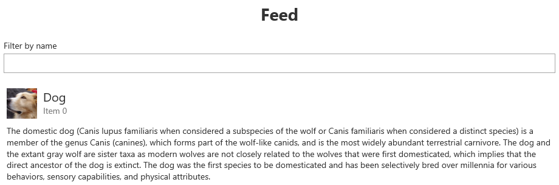
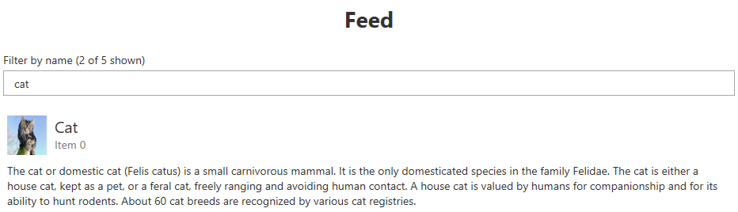
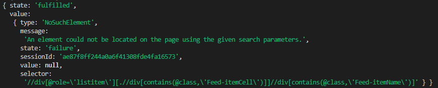

## Overview and Objective

The objective of a `Page` is to map the structure of a website. It is essentially an
aggregation of all `PageNode` instances that make up a complete website or a large fragment
of a website. In order to create these `PageNode` instances, each `Page` has an instance of
a `PageNodeStore` class associated with it that is available via its `_store` class member.

Pages allow us to assign meaningful names to the page nodes in its scope. They also
define XPath selectors to locate these page nodes in the DOM. Since page nodes usually always
live within the scope of a `Page`, pages act as interfaces for testcases who want to access
a certain page node in order to interact with its corresponding HTML elements on a website.

Finally, each `Page` needs to implement two life cycle methods, `isOpen` and `isClosed`,
to indicate whether a page is fully loaded or not. These life cycle methods come in handy
when a single testcase interacts with more than one page and needs to switch pages.

## Location and Naming Convention

Page files are located in the `src/page_objects/pages` folder of your system test
directory. I usually like to name page classes so that they end with the term 'Page'
but from a technical perspective, this is not required and you do not need to follow
this convention.

## Code Example

The following sections of this page guide often refer to code snippets taken
from the `BasePage` class which is located at `src/page_objects/pages/BasePage.ts`
in the wdio-workflo-example repository.

This base class implements some common functionality for all pages of our
web application.

Here is the complete `BasePage.ts` file for a better overview:

```typescript
import { stores } from '?/page_objects';
import { Page, IPageOpts } from './Page';

import { workfloConfig } from '~/workflo.conf';

export interface IBasePageOpts<
  Store extends stores.PageNodeStore
> extends IPageOpts<Store> {
  pageName: DemoApp.PageName;
}

export abstract class BasePage<
  Store extends stores.PageNodeStore
> extends Page<Store> {
  pageName: DemoApp.PageName;

  constructor(opts: IBasePageOpts<Store>) {
    const { pageName, ...superOpts } = opts;
    super(superOpts);

    this.pageName = pageName;
  }

  get container() {
    return this._store.Element(
      xpath('//main'),
    );
  }

  get heading() {
    return this.container.$.Element(
      xpath('//h1')
    );
  }

  // check if pathname section of current browser url starts with our page's name
  private _doesUrlMatchPageName() {
    const pathName = browser.getUrl().replace(workfloConfig.baseUrl, '');

    // we need to double escape backslashes because they are interpreted as a string first
    const pageNameRegex = new RegExp(`^\\/${this.pageName}(\\?|\\/)*`);

    return pageNameRegex.test(pathName);
  }

  isOpen(): boolean {
    return this._doesUrlMatchPageName() &&
      this.heading.currently.isVisible() &&
      this.heading.currently.getText().toLowerCase() === this.pageName;
  }

  isClosed(): boolean {
    return !this._doesUrlMatchPageName() ||
      this.heading.currently.not.isVisible() ||
      this.heading.currently.getText().toLowerCase() !== this.pageName;
  }
}
```

## Structure

### Typing and Constructor

At the top of a page file, we need to declare the type of our page's `opts`
parameter as interface, define the page's class and type parameters and implement
its constructor:

```typescript
export interface IBasePageOpts<
  Store extends stores.PageNodeStore
> extends IPageOpts<Store> {
  pageName: DemoApp.PageName;
}

export abstract class BasePage<
  Store extends stores.PageNodeStore
> extends Page<Store> {
  pageName: DemoApp.PageName;

  constructor(opts: IBasePageOpts<Store>) {
    const { pageName, ...superOpts } = opts;
    super(superOpts);

    this.pageName = pageName;
  }

  /*...*/
}
```

In our code example, we implement `BasePage` as an `abstract` class that cannot live on
its own but needs to be extended by all (or most) normal page classes of our web application.

Each page of our web application has a `pageName`. By appending this `pageName` to the
base url of our web application, we can navigate to the corresponding page if we enter
the combined URL into the address bar of a browser.

So, to declare the type of our page's `opts` parameter, we extend `IBasePageOpts` from
wdio-workflo's `IPageOpts` interface and add our additional `pageName` property.
The `pageName` property is of the type `DemoApp.PageName` which is a list of
string literals containing the names of all the pages of our web application:

```typescript
namespace DemoApp {
  type PageName = 'feed' | 'registration'
}
```

Then we extend our `BasePage` class from wdio-workflo's `Page` class and declare it
to be `abstract` since it only serves as a common base class that should be extended
by all other page classes of our web application.

Both wdio-workflo's `Page` class and its `IPageOpts` interface require us to define
one type parameter: the type of the `PageNodeStore` associated with the page.
For our base class, however, we don't want to define a specific store class,
because each page extending it could be associated with a different store. Therefore,
our `BasePage` class and its `IBasePageOpts` use a generic `Store` type and they themselves require you
to define this `Store` type as a type parameter in all page classes that extend our `BasePage` class.

This may sound a little complicated, but I think the following example explains
how a normal page class can be extended from our `BasePage` class:

```typescript
import { stores } from '?/page_objects';

import { BasePage } from '../BasePage';

export class FeedPage extends BasePage<stores.FeedStore> {

  constructor() {
    super({
      store: stores.feeds,
      pageName: 'feed'
    });
  }

  /*...*/
}
```

As you can see, the `FeedPage` class which extends our `BasePage` class defines
the generic `Store` type parameter of our `BasePage` (the type of the `PageNodeStore`
associated with `FeedPage`) to be `stores.FeedStore`.

In its constructor, `FeedPage` sets the value of the `store` property of `BasePage`'s `opts` parameter
to `stores.feeds` and the value of its `pageName` property to `'feed'`.

### Defining Page Nodes

#### Quick Instructions

As already mentioned, the main objective of a `Page` is to map the structure of a website.
To do so, we need to define a class property for each `PageNode` that resides within the page's scope.

Wdio-workflo wants you to define these page node properties using [getter functions](https://developer.mozilla.org/en-US/docs/Web/JavaScript/Reference/Functions/get)
to ensure that the HTML elements mapped by a page node are located again on the
website and fetched each time we invoke the state interaction functions of a page node
(e.g. `getText`, `click`...).

A common scenario for a page is to have a `container` page node that wraps all other
content of the page. The following code example shows you how to define a property
for the `container` page node on the `BasePage` class using a getter function:

```typescript
class BasePage {
  get container() {
    return this._store.Element(
      xpath('//main'),
    );
  }
}
```

As you can see, we define our `container` class property using the `get` keyword.
We then access the `PageNodeStore` instance associated with our `BasePage` class
via `this._store` and invoke the store's `Element()` [factory method](store.md##factory-methods)
to obtain an instance of a `PageElement` class for our `container` element.

The `Element()` factory method requires us to pass an XPath selector for our `PageElement`
that locates the HTML element corresponding to our `container` on the website. To define an
XPath selector, you can either write a "raw XPath string", or you can use wdio-workflo's
[XPath builder](./xpathBuilder.md) that facilitates writing complex XPath selectors, like
in our code example above.

*Please be aware that wdio-workflo only supports XPath selectors and no CSS selectors
because XPath selectors are more "flexible" than CSS selectors
(they support searching for a parent element) and because the performance differences
between XPath selector and CSS selectors are negligible in most cases.*

Typically, if your page has a `container` page node, all other page nodes will
want to prepend the XPath selector of the `container` to their own. To do so, the other
page nodes can use the `$` accessor of the `container` page node which returns
the `PageNodeStore` associated with the `container` and prepends the XPath selector
of the `container` page node automatically when invoking a factory method via its `$` accessor:

```typescript
class RegistrationPage extends BasePage<stores.PageNodeStore> {
  get submitButton() {
    return this.container.$.Element(
      xpath('//button').text('Submit')
    );
  }
}
```

In the code example above, the combined XPath selector of the `submitButton` element
would be `"//main//button[.='Submit']"`.

If you can live with the fact that when writing tests in wdio-workflo, by convention,
page nodes are defined within the scope of a page using getter functions,
you can skip the rest of this chapter.

However, if you'd like to learn why wdio-workflo urges you to use getter functions
to define page nodes on a page, please keep on reading the following sections of this chapter!

#### Pages and Page Nodes are Stateless

When dealing with pages, you need you to realize an important concept: Pages are stateless!

Neither a page, nor any of the page nodes defined within its scope, store information
about the state of the GUI they represent. Instead, all of the information about the GUI's state
is stored within the GUI itself. Actually, the GUI's whole purpose is to display the state of the
tested application in a user-friendly way. Therefore, there is no difference between the GUI and
the GUI's state - they are the same.

If we want to retrieve information about the state of the GUI, we need to invoke one of a
page node's state retrieval functions, e.g. `getText()`. Each state retrieval function
first needs to locate the HTML elements mapped by a page node on the website before it can
read their state. And it needs to do so every time it is invoked, because modern web applications
are dynamic and their content/the HTML elements displayed on their websites
can change quite often. This is particularly true in the case of single page applications
(SPAs), which technically consist of only one single HTML website (typically index.html)
and whose content is changed via JavaScript DOM manipulation to display different views/pages.

Let's take wdio-workflo's demo application as an example. It has a feed and a registration
page which are both displayed by the same index.html file. The feed page also has
a textfield that filters the displayed feed items by their title.
If we do not enter a term to filter our feed items, the first item displayed in the
feed is a dog. If we filter by the term 'ca', the first item displayed in the feed
becomes a cat:




Now to test if our feed filter is working correctly, we want to retrieve the text
of the first feed item's title before and after entering the term 'ca' into our textfield.
This will only work if the underlying HTML element is located again on the website each time
we invoke `getText()` on it's corresponding page node. Otherwise, after entering the term
'ca' into the textfield, we would either still receive the previous title's text ("Dog")
or a [stale element error](https://www.seleniumhq.org/exceptions/stale_element_reference.jsp)
would occur because the HTML element containing the text "Dog" no longer exists on the website.

#### Defining Page Nodes using JavaScript Getters

To quote [webdriverio's docs](http://v4.webdriver.io/guide/testrunner/pageobjects.html),
getter functions get evaluated when you actually access the property (`container`) and not when you
generate the object (the surrounding `BasePage` class).
With that you always request the element (from the website) before you do an action on it:

```typescript
class BasePage {
  get container() {
    return this._store.Element(
      xpath('//main'),
    );
  }
}
```

Before I'll show you what would happen if we did not use JavaScript getters to define our page nodes,
let's remember that each `PageNode` class is essentially an additional layer of abstraction
that wraps the commands provided by webdriverio's `browser` object. Taking our feed items from above
as an example, if we fetch an instance of `FeedItemList` from a store and call the `getText`
function on the `title` subelement of the first feed item, wdio-workflo internally invokes the
corresponding webdriverio commands:

```typescript
this.container.$.FeedItemList(
  xpath('//div').attribute('role', 'listitem').hasChild(
    '//div', xpath => xpath.classContains('Feed-itemCell')
  ),
).first.title.getText();

/*internally invokes*/

browser.element(
  "//div[@role='listitem'][.//div[contains(@class,'Feed-itemCell')]]//div[contains(@class,'Feed-itemName')]"
).getText();
```

The `element` command defined on webdriverio's `browser` object tries to locate
an HTML element on a website using the provided selector and fetches the first found
element on the page. You can then invoke other commands like `getText` on the fetched
element to interact with the located HTML element.

For the sake of simplicity, let's assume that our feed page has only one property
called `firstFeedItemTitle` which we fetch from the website using webdriverio's `element`
command directly, skipping the additional `PageNode` abstraction layer.

Let us now compare two different ways of defining our `firstFeedItemTitle` property
within the scope of the `FeedPage`:

- As a "normal" class property (don't do this!)
- Using a getter function

Take a look at this code example:

```typescript
class FeedPage {
  // Variant A: a "normal" class property
  firstFeedItemTitle = browser.element(
    "//div[@role='listitem'][.//div[contains(@class,'Feed-itemCell')]]//div[contains(@class,'Feed-itemName')]"
  )

  /*or*/

  // Variant B: using a getter function
  get firstFeedItemTitle() {
    return browser.element(
      "//div[@role='listitem'][.//div[contains(@class,'Feed-itemCell')]]//div[contains(@class,'Feed-itemName')]"
    )
  }
}

export const feed = new FeedPage();
```

To observe how these two variants of defining `firstFeedItemTitle` would lead to a
different outcome, let's examine the following little testcase that validates our feed's filtering behavior
by comparing the title of the first feed item before and after filtering the list using the term "ca":

```typescript
import { pages } from '?/page_objects';
import { steps } from '?/steps';

testcase("feed filtering", {}, () => {
  given(steps["open demo website"]())
  .and(steps["open page '%{page}'"]({
    args: { page: pages.feed },
    cb: () => {
      validate({ "0.1": [1] }, () => {
        const titleBeforeFiltering = pages.feed.firstFeedItemTitle.getText()

        expect(titleBeforeFiltering).toEqual('Dog')
      });
    }
  }))
  .when(steps["filter feed items by term %{term}"]({
    args: { term: 'ca' },
    cb: () => {
      validate({ "0.1": [2] }, () => {
        const titleAfterFiltering = pages.feed.firstFeedItemTitle.getText()

        expect(titleAfterFiltering).toEqual('Cat')
      });
    }
  }));
})
```

As you can see, our testcase needs to access our `firstFeedItemTitle` property
and call `getText()` on it two times: before and after filtering the feed items list.

In order for our testcase to behave as expected and return a different text before
and after filtering, the HTML element containing the text of the
first feed item's title needs to be fetched from the website each time we invoke the
`getText` function. This is exactly what happens if we defined `firstFeedItemTitle`
like variant B, using a getter function because getter functions are reevaluated
each time we access them. In fact, a getter function could also be written as a normal
function, but in this case, we would have to use function parenthesis and name
our class property like a method, e.g. `getFirstFeedItemTitle()`, which does
not look as nice:

```typescript
class FeedPage {
  getFirstFeedItemTitle() {
    return browser.element(
      "//div[@role='listitem'][.//div[contains(@class,'Feed-itemCell')]]//div[contains(@class,'Feed-itemName')]"
    )
  }
}

const feed = new FeedPage()

feed.getFirstFeedItemTitle().getText()
```

But what about variant A, defining `firstFeedItemTitle` as a "normal" class property,
without using a getter function? In this case, `firstFeedItemTitle` would be evaluated
only one time, when our `FeedPage` class gets instantiated. This would also mean that
the HTML element containing the text of the first feed item's title would be located and fetched
on the page only once to set the value of `firstFeedItemTitle`.

So what's the problem with that? If you look at our testcase code example closely,
you will notice that our `FeedPage` instance is stored in `pages.feed` and that the
`pages` object gets imported on the first line of our testcase file.
However, the step that opens our feed page, `steps["open page '%{page}'"]`, occurs several lines later.
This means that wdio-workflo will not be able to locate the HTML element described by the selector of
`firstFeedItemTitle` because the feed page which contains this HTML element is not even loaded yet.

Fetching `firstFeedItemTitle` via the `browser.element` command would return a `NoSuchElement` result:



As you can imagine, calling functions like `getText` or `click` on an element that could
not be located on the website will not work and cause your testcase to break, fail or behave unexpectedly.

After this rather long and detailed explanation, I hope you now understand why wdio-workflo
urges you to define page nodes using getter functions by convention.

### Implementing "LifeCycle" Methods

#### Implementing `isOpen` and `isClosed`

Each page derived from wdio-workflo's `Page` class requires you to implement the
methods `isOpen` and `isClosed`. If a page is currently fully loaded, `isOpen` is
supposed to return true and otherwise to return false. For `isClosed` it is the exact opposite.

These methods are typically invoked whenever you need to switch pages in your tested
application. They are meant to ensure that a page change has been fully completed
before the execution of a testcase resumes.

To check if the new page has been fully loaded, you usually check if a certain
element of the new page (e.g. a header) has already been rendered. If your app uses
URL routing, you should also make sure that the URL has changed in the browser's
address bar.

This code example shows the `BasePage` class' implementation of `isOpen` and `isClosed`:

```typescript
// check if pathname section of current browser url starts with our page's name
private _doesUrlMatchPageName() {
  const pathName = browser.getUrl().replace(workfloConfig.baseUrl, '');

  // we need to double escape backslashes because they are interpreted as a string first
  const pageNameRegex = new RegExp(`^\\/${this.pageName}(\\?|\\/)*`);

  return pageNameRegex.test(pathName);
}

isOpen(): boolean {
  return this._doesUrlMatchPageName() &&
    this.heading.currently.isVisible() &&
    this.heading.currently.getText().toLowerCase() === this.pageName;
}

isClosed(): boolean {
  return !this._doesUrlMatchPageName() ||
    this.heading.currently.not.isVisible() ||
    this.heading.currently.getText().toLowerCase() !== this.pageName;
}
```

Similar to the classes of the `PageNode` family, each `Page` class also has
a `wait` and an `eventually` API. The `wait.isOpen`, `wait.isClosed`, `eventually.isOpen`
and `eventually.isClosed` functions will periodically invoke your `isOpen` and `isClosed`
implementations until their condition returns true or until a specific timeout has been reached.

However, since pages, unlike page nodes, do not perform implicit waiting,
pages do not have a `currently` API. Instead, all methods defined directly
on a `Page` class (like `isOpen` and `isClosed`) always reflect the current state of the GUI.

#### Defining Parameter Objects for `isOpen` and `isClosed`

You can also pass a parameters object to your `isOpen` and `isClosed` functions.
The types of these parameters objects can be set via the second and third type parameters
of the `Page` class:

```typescript
interface IIsOpenOpts {
  headingText: string;
  urlFragment: string;
}

interface IIsClosedOpts {
  urlFragment: string;
}

class MyPage extends Page<stores.PageNodeStore, IIsOpenOpts, IIsClosedOpts> {

  get heading() {
    return this._store.Element(
      xpath('//h1')
    );
  }

  isOpen(opts: IIsOpenOpts) {
    return browser.getUrl().indexOf(opts.urlFragment) >= 0 &&
      this.heading.currently.hasText(opts.headingText);
  }

  isClosed(opts: IIsClosedOpts) {
    return browser.getUrl().indexOf(opts.urlFragment) < 0 ||
      this.heading.currently.not.hasAnyText();
  }
}

const myPage = new MyPage({
  store: stores.pageNode
});

myPage.wait.isOpen({
  headingText: 'Login',
  urlFragment: 'login',
  timeout: 10000
});
```

The types you defined for `IsOpenOpts` and `IsClosedOpts` will then be merged
with the default `Workflo.ITimeoutInterval` type, which consists of an `interval`
and a `timeout` property, and will be used to define the type of the arguments
object passed to the `wait.isOpen`, `wait.isClosed`, `eventually.isOpen` and
`eventually.isOpen` functions.

### Instantiating and Exporting Pages

Since pages are stateless and basically serve as an interface to invoke
state interaction functions on the page nodes defined within its scope,
we usually do not need more than one instance of a certain `Page` class.

I typically create and export this single instance of a `Page` class at the bottom
of the page's file:

```typescript
export class FeedPage extends BasePage<stores.pageNode> {
  /*...*/
}

export const feed = new FeedPage();
```

In addition, you also need to add an `export *` entry for each page file to the `index.ts` file
located in the `src/page_objects/pages` folder:

```typescript
export * from './FeedPage';
export * from './RegistrationPage';
```

When writing testcases are implementing steps, all of your page classes and instances
will now be available on the `pages` object which you can import from the `?/page_objects` folder:


## Base Page Class

In most cases, the different pages of a tested web application will all share some
common structure or behavior. For this reason, it is advisable to create a
`BasePage` class that implements common behavior of all page classes derived
from the base page class.

The `BasePage` class of the wdio-workflo-example repository acts as the
[main code example](#code-example) of this guide.

It provides common functionalities and elements of each page of wdio-workflo's
demo website:

- It implements `isOpen` and `isClosed` because all pages share the same page loading behavior
- It defines a `container` and a `heading` page node for each page

## Page Fragments

For big and complex pages, it can sometimes be useful to split a page into so-called
page fragments. This helps you to better organize your pages and avoid clutter.

Page fragments also inherit from wdio-workflo's `Page` class and they map
the structure of certain areas of a website, for example a footer, a header or
a toolbar.

You can then simply instantiate your page fragments as properties of your
complex, combined page class:

```typescript
import { stores } from '?/page_objects';
import { Page, IPageOpts } from './Page';

class Toolbar extends Page<stores.PageNodeStore> {

  get container() {
    return this._store.Element(
      xpath('//div').classContains('toolbar')
    )
  }

  get copyButton() {
    return this.container.$.Element(
      xpath('//button').text('Copy')
    )
  }

  isOpen() {
    return this.container.currently.exists();
  }

  isClosed() {
    return this.container.currently.not.exists();
  }
}
```

```typescript
import { stores } from '?/page_objects';
import { Page, IPageOpts } from './Page';

import { Header } from './';
import { Footer } from './';
import { Toolbar } from './';

class EditorPage extends Page<stores.PageNodeStore> {

  readonly header = new Header({store: stores.pageNode})
  readonly footer = new Footer({store: stores.pageNode})
  readonly toolbar = new Toolbar({store: stores.pageNode})
}

const editor = new EditorPage();

/*...*/

editor.toolbar.copyButton.click();
```