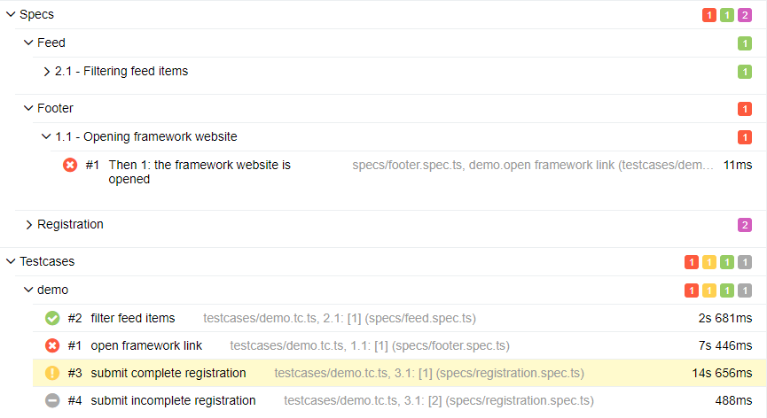

## Introduction

### Overview

Wdio-workflo supports two test reporters:

- A spec reporter for test development which outputs results on the console.
- An allure reporter for continuous integration which generates a visually appealing results website.

### Result Status

While wdio-workflo's reporters pursue different goals, they share the same definitions for possible
result status:

- **passed** *(green)* - All validations of a testcase or spec (acceptance criteria) passed.
- **failed** *(red)* - At least one validation of a testcase or spec failed (actual and expected value didn't match).
- **broken** *(yellow)* - There was a runtime error inside a testcase/one of the testcases that validate a spec.
- **skipped** *(blue/grey)* - The execution of a testcase or spec was skipped (eg. `xtestcase` or `xThen`).
- **unknown/unvalidated** *(magenta)* - A spec was not validated (eg. because of a broken testcase).

*The `broken` status always has precedence over the `failed` status. So for a testcase, if a validation fails and afterwards
a runtime error occurs, the testcase will be marked as `broken`. For a spec, if at least one of the testcases which validate
the spec is `broken`, the spec is marked as `broken`.*

## Spec Reporter

### Objective

The spec reporter's main objective is to support you during the phase of test
development. It automatically outputs its results to the console window from
which you launched your tests.

The spec reporter can be integrated very well with your code editor if you launch
your tests from eg. VS Code's integrated terminal. This gives you the ability to
click on a line of an error/validation failure stacktrace and jump directly to
the described file and line number in your code.

### Structure

A spec report consists of 3 main sections:

- The results of your testcases
- The validation results of your specs (stories and acceptance criteria)
- A summary of your test results

#### Testcase Results

During the first phase of a test run, wdio-workflo performs the following steps for each `.tc.ts`
file inside your `testcase` folder:

- Executing all testcases that match your test execution filters (if you defined any).
- Displaying the result status for each testcase, grouped by their parent suites.
- Showing a list of all validation failures and runtime errors that occurred during test execution.


#### Spec Validation Results

After all testcases have been run, wdio-workflo now links the results of all validations
performed within a testcase to the specs referenced by the validation object.

For each `.spec.ts` file inside your `specs` folder, wdio-workflo will now:

- Display the validation results of your specs (acceptance criteria) grouped by their parent stories.
- Show a list of all validation failures and runtime errors that occurred during a spec validation.


#### Summary

The spec report's summary of your test run starts with a list of all validation failures and runtime errors
that occurred during the execution of testcases and within spec validations.


At the very end of your spec report you can find some test statistics, including information such as:

- The number of executed testcase and spec files, suites, testcases, features and specs.
- The duration of testcase execution and spec validation.
- The coverage of your acceptance criteria (automated, manual, unvalidated).
- The percentage and count of passing/skipped/failing/broken/unvalidated testcases and specs.


### Configuration Options

By default, the spec reporter does not output errors immediately and only logs the
name of executed testcases (but not the performed steps).

To change this behavior, your can alter the values of the options `reportErrorsInstantly` and `consoleLogLevel` in your `workflo.conf.ts` file or as CLI options.

This picture shows `reportErrorsInstantly` set to `true` and `consoleLogLevel` set to `'steps'`:


## Allure Reporter

### Objective

The [Allure report](http://allure.qatools.ru/) was developed by Qameta Software to create test execution reports that are clear to everyone in the team.

Wdio-workflo uses its Allure reporter to assist you in analyzing the results of
test runs executed on a build server as part of your continuous integration process.

### Features

Allure reports provide many features to improve the analysability of your tests:

- An appealing visual report format served as a website
- An overview page to deliver the most important information at one glance
- Stacktraces and screenshots for errors and validation failures
- Specs and testcases are hierarchically grouped, searchable and filterable to help you find
things faster
- A complete overview of all steps executed during a testcase with their results and parameters
- Traceability between your specs and the testcases which validate them
- The duration of each testcase to analyse the time behavior of your tests

### Drawbacks

Unfortunately, the charts in an Allure report (eg. the pie chart on the "Overview" page)
are not able to distinguish between wdio-workflo's testcases and specs - Allure summarizes both as "tests" and "test cases".

To view wdio-workflo's testcases and specs as two correctly separated groups,
you can visit the "Behaviors" page or take a look at the "ENVIRONMENTS" section on the "Overview" page.

### Pages

The Allure report consists of several pages:

- Overview
- Categories
- Graphs
- Timeline
- Behaviors

*There are also two additional pages, "Suites" and "Packages", which can be ignored
because they do not provide much additional value in the context of wdio-workflo.*

#### Overview

The "Overview" page shows you the most important information at one glance.

It includes a pie charts of your test results (unfortunately summarizing testcases and specs as "tests"):


You can also find some test statistics data in the "ENVIRONMENT" section:


A trend of your previous test runs allow you to track the "health" of your tested application:


The "EXECUTORS" section provides a link to the job on your build/CI server which started the current test run:


#### Categories

The "Categories" page shows a quick summary of all validation failures ("Product defects")
and runtime errors ("Test defects") that occurred during the current test run:


#### Graphs

The "Graphs" page uses a couple of different graphs to deliver various information.

A "Status" chart shows the result status of your testcases and specs combined as "tests":


A "Duration" chart groups your testcases (and specs) by duration of execution:


A "Severity" chart groups your testcases and specs by severity:


#### Timeline

The "Timeline" page shows the order in which testcases were run and
the points in time at which each testcase started and ended:


#### Behaviors

##### Categories Tree

The "Behaviors" page is probably the most useful page for analyzing your wdio-workflo
tests.

It displays the result status of your testcases and specs separated into two categories:


You can filter your testcases and specs by result status and use the search field
at the top of the page to find specific testcases or specs. By clicking on "Specs", you can browse all Features, Stories and Acceptance Criteria. Clicking on "Testcases" displays
all Suites and Testcases.



##### Details View

If you select a single testcase or spec, a detailed view of the testcase/spec
is displayed on the right side:


If you want to rerun a broken or failed testcase, you can copy the testcase name
at the top of the details view.

Below the testcase name, there is a list of all errors and validation failures that
occurred during the execution of the testcase. You can click on the list to show
the stacktraces of each error/validation failure.

The next section shows the severity and duration of your testcase, as well as the
file in which it is defined and the specs it validates.

At the bottom of the details view there is a list of all steps executed within the testcase.
You can expand each step to show the step's arguments, any nested steps and all
selenium requests sent during the execution of a step. Additionally, if
any runtime errors or validation failures occurred within a step, they are also
displayed together with screenshots of the application at the time of failure:


### Configuration Options

#### Disabling Selenium Commands Logging

By default, wdio-workflo logs each selenium command request (as well as its parameters and response object)
as a single step in your Allure report.

If this is too much information for you, you can set the `debugSeleniumCommands` option in your
`workflo.conf.ts` file to `false`.

#### Issue Tracking And Test Management Patterns

The Allure report can create links to the bugs, testIds and issues which you defined in your `testcase`
or `Story` metadata objects. In order for this to work, you need to configure the base urls for your
test management and issue tracking tools.

To do so, set the following options in `workflo.conf.ts`:

```typescript
allure: {
  // base url for bugs and issues, %s will be replaced by bug/issue id
  issueTrackerPattern: 'http://example.com/issues/%s',
  // base url for testIds, %s will be replaced by the testId
  testManagementPattern: 'http://example.com/tms/%s',
},
```

### Build Server Integration

There are plugins available for several build servers (including Jenkins, TeamCity, Maven) which enable
you to easily display and integrate Allure reports in your continuous integration pipeline.

For more information, see https://docs.qameta.io/allure/#_reporting.
