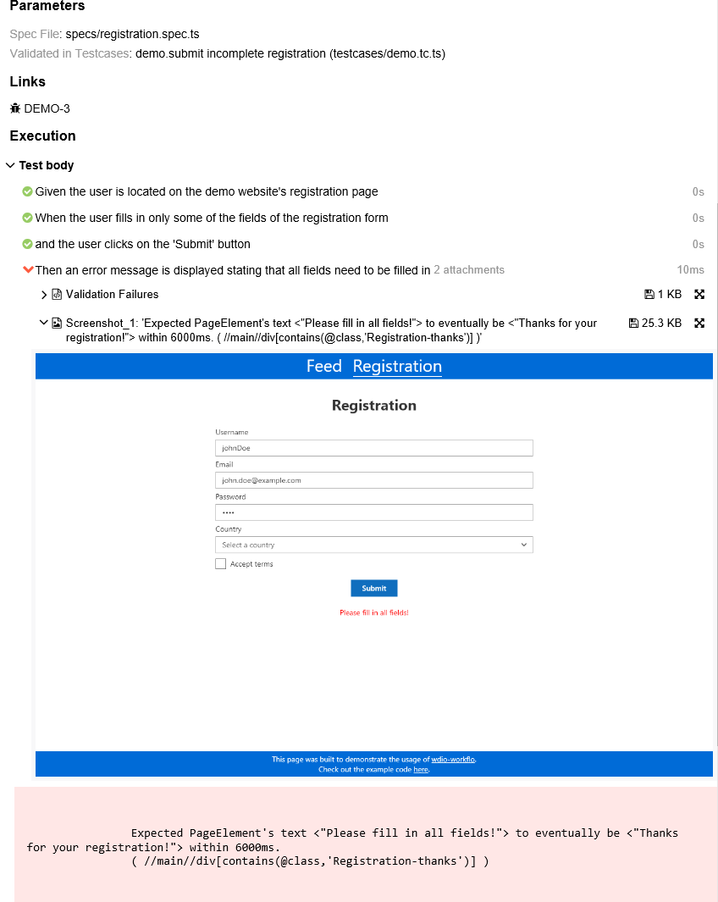

## Objective and Overview

Wdio-workflo follows a behavior-driven approach and encourages you to define the requirements
of your application in so-called **Spec** files before you start writing testcases.

In agile software development, requirements are usually represented as user stories.
To specify the conditions under which a user story is fulfilled correctly, one defines acceptance criteria.

Wdio-workflo's `Story` function lets you write user stories in a way that the test framework can understand.
Basically, wdio-workflo views your web application (or rather its graphical user interface) as a state machine.
Stories consist of initial states, state changes and final, expected states.
Together, they make up the acceptance criteria of our story.

Since we want all stakeholders of a project to be able to understand our story and its acceptance criteria,
we formulate our states and state changes in natural language. To do so, we can use the
[Gherkin-Language](https://docs.cucumber.io/gherkin/) keywords `Given`, `When`, `Then` and `And` inside
the body function of a `Story`.

Related `Story` functions are grouped together inside a `Feature`.

## Location and Naming Convention

Spec files are located in the `src/specs` folder of your system test directory.
By convention, their filename always ends with `.spec.ts`.

## Example

To give you an example of how specs are written in wdio-workflo, lets define
some requirements for the registration form of wdio-workflo's demo website!

The form has 5 input fields:

- 3 textfields for the username, the email and the password
- 1 dropdown to select the user's country
- 1 checkbox to accept the terms of the website

The registration process can only succeed of the user fills in all 5 fields. In this case,
when the user hits the "Submit" button, a success message should be displayed thanking
the user for his/her registration.

If the user does not fill in all 5 fields and hits the "Submit" button, an error message
should be displayed telling the user that she/he needs to fill in all form fields.

Take a look at the file `registration.spec.ts` located in the folder `src/specs` of the
wdio-workflo-example repository to see how these requirements can be formulated as
wdio-workflo specs:

```typescript
Feature("Registration", {}, () => {
  Story("3.1", "Submitting the registration form", { issues: ["DEMO-3"] }, () => {
    Given("the user is located on the demo website's registration page", () => {
      When("the user fills in all fields of the registration form")
      .And("the user clicks on the 'Submit' button", () => {
        Then(1, "a success message is displayed thanking the user for her registration");
      });

      When("the user fills in only some of the fields of the registration form")
      .And("the user clicks on the 'Submit' button", () => {
        Then(2, "an error message is displayed stating that all fields need to be filled in");
      });
    });
  });
});
```

## Syntax

### Feature

The `Feature` function is used to group multiple related stories together - e.g. all stories that describe the behavior of a website's registration process:

```typescript
Feature("Registration", {}, () => { /*your stories go here*/ })
```

It has 3 parameters:

- The name of the feature
- The metadata of the feature (reserved for future use - at the moment, this is always an empty object)
- The body function of the feature - you can define all related `Story` functions within its scope

### Story

The `Story` function lets you define a user story:

```typescript
Story("3.1", "Submitting the registration form", { /*metadata*/ }, () => { /*acceptance criteria*/ })
```

It has 4 parameters:

- The ID of the story which must be uniquely identifiable
- The title of the story
- The metadata of the story
- The body function of the story used to define its acceptance criteria with Gherkin keywords

The ID parameter is needed to reference the story from the validations performed within a testcase
and must therefore be unique across all spec files.

#### Story metadata

You can define the following optional properties for the metadata parameter of a `Story` function:

- `severity` => How severe the consequences of this story not being fulfilled would be (default: `normal`)
- `issues` => If your story is derived from e.g. JIRA issues, you can define the JIRA issue keys here
- `bugs` => If your story is affected by bugs which you track on e.g. JIRA, put the bugs' JIRA keys here

```typescript
{
  severity: 'critical', // from most to least severe: blocker, critical, normal, minor, trivial
  issues: ["DEMO-3"],
  bugs: ["DEMO-BUG-1", "DEMO-BUG-2"]
}
```
*The `severity` can be useful for [CLI execution filters](runningTests.md#cli-execution-filters).
The `severity`, `issues` and `bugs` are all displayed on your [Allure test report](reporters.md#allure-reporter).*

### Given

The `Given` function is used to establish an initial state for your story:

```typescript
Given("the user is located on the demo website", () => { /*state changes or nested initial states*/ } )
```

It has 2 parameters:

- The description of an initial state
- The body function used to define state changes or nested initial states

If your initial state is a little more complex, you can also split its description
into several `Given` functions.

Usually, you would just chain the split `Given` functions together using the `.And` keyword:

```typescript
Given("the user is located on the landing page")
.And("the user is logged in with admin rights")
```

However, you can also nest a `Given` function inside the body function of another `Given` function.
This is especially useful if your initial state has several diverging "branches":

```typescript
Given("the user is located on the landing page", () => {
  Given("the user is logged in with admin rights", () => { /*state changes*/ })
  Given("the user is logged in with standard rights", () => { /*state changes*/ })
})

```

### When

The `When` function represents state changes in your tested application and should be placed
inside the body function of a `Given` function:

```typescript
Given("the user is located on the registration page", () => {
  When("the user clicks the 'submit' button", () => { /*nested state changes or expected states*/ })
})
```

It has 2 parameters:

- The description of the state change
- The body function used to define expected states or nested state changes

Usually, you want to perform not only one, but several state changes in a row.
To do so, you can chain multiple `When` functions together using the `And` keyword:

```typescript
When("the user enters his/her username")
.And("the user ticks the 'accept terms' checkbox")
.And("the user clicks the 'submit' button", () => { /*nested state changes or expected states*/ })
```

However, the `When` function too can be nested inside the body function of another `When` function
if you need to depict diverging state change branches:

```typescript
When("the user ticks the 'accept terms' checkbox", () => {
  When("the user clicks the 'submit' button", () => { /*nested state changes or expected states*/ })
  When("the user click the 'cancel' button", () => { /*nested state changes or expected states*/ })
})
```

### Then

The `Then` function describes the expected state of an acceptance criteria and should be placed
inside the body function of a `When` function:

```typescript
When("the user clicks on the 'submit' button", () => {
  Then(1, "a message is displayed thanking the user for his/her registration")
})
```

It has 2 parameters:

- The ID of the acceptance criteria
- The description of the expected state of the acceptance criteria

The ID parameter, in combination with the ID of its surrounding `Story`, is needed to
reference the acceptance criteria from the validations performed within a testcase.
It must therefore be unique within a `Story`.

## Specs in Test Reports

Wdio-workflo's [spec report](reporters.md#spec-reporter) shows the result status
of the validations performed for each acceptance criteria within a story.

However, if you also want to read the complete sequence of all states and state changes
performed to validate a single acceptance criteria, you need to view your test results
in the [Allure report](reporters.md#allure-reporter).

Open the "Behaviors" page in your Allure report, locate your story within the "Spec" group
and select an acceptance criteria. You will see a sequence of each state and state change
of the acceptance criteria in the details view on the right side of the page:



The details view also shows you which testcases validated the selected acceptance criteria
and, if any errors or validation failures ocurred, it will display
error stacktraces and screenshots of the GUI at the time of failure.

Furthermore, the report displays the `issues` and `bugs` defined in the metadata parameter of the
`Story` function as clickable links which take you to the corresponding JIRA issue page, for example.