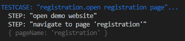
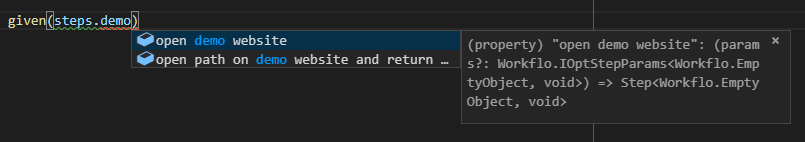
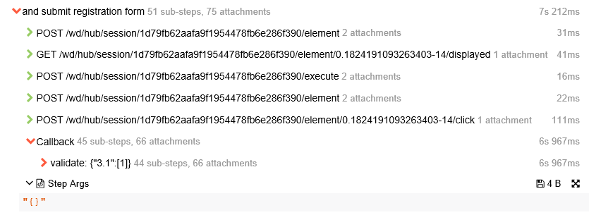

## Objective and Overview

Steps represent interactions between a user and a system which usually cause the
state of the tested application to change.

To modify or query the state of the GUI, steps access the page nodes defined within a
`Page` and invoke functions on them, e.g. a `click` on a `PageElement`.

Therefore, steps are an important link between testcases and page objects and
they greatly improve reusability by encapsulating test logic in functions
that can be invoked by any testcase.

Each step has a description written in natural language which is displayed
in test reports. This allows stakeholders without a technical background to
comprehend testcases.

## Location and Naming Convention

Step files are located in the `src/steps` folder of your system test directory.
By convention, their filename always ends with `.step.ts`.

## Examples

A very basic example of a `Step` can be found inside the file `registration.step.ts`
located in the `src/steps` folder of the wdio-workflo-example repository:

```typescript
"submit registration form":
(params?: IOptStepParams<Workflo.EmptyObject, void>) =>
  new Step(params, (): void => {
    pages.registration.submitButton.click();
  }),
```

## Implementing Steps

### Step Definition Functions/Object

Steps are implemented within step definition functions. A step definition function takes a step parameter object and returns an instance of the `Step` class.

Related step definition functions are stored inside a step definitions object.
The keys of this object are descriptions of the steps written in natural language
and its values are the according step definition functions.

To make sure that your step definitions are correctly typed, pass your step
definitions object to wdio-workflo's `defineSteps` function. Have a look at the
file `registration.step.ts` located in the `src/steps` folder of your wdio-workflo-example
repository:

```typescript
import { defineSteps, IOptStepParams, IStepParams, Step } from 'wdio-workflo';

import { pages } from '?/page_objects';

const registrationSteps = defineSteps({
  "fill in registration form":
  (params: IStepParams<{formData: pages.RegistrationFormData }, void>) =>
    new Step(params, ({ formData }): void => {
      pages.registration.form.setValue(formData);
    }),

  "submit registration form":
  (params?: IOptStepParams<Workflo.EmptyObject, void>) =>
    new Step(params, (): void => {
      pages.registration.submitButton.click();
    }),
});

export { registrationSteps };
```

*The `defineSteps` function returns the exact same step definitions object which was
passed to it as parameter. Its only purpose is to ensure your step definitions are
correctly typed.*

### Step Parameters

#### Step Parameters Object and Step Arguments

A step definition function can take one parameter: a step parameters object.
The step parameters object has two properties:

- `args` => An object to define arguments passed to a `Step` which can be mandatory or optional
- `cb` => The callback function of a step which is invoked immediately after the step's execution

If a `Step` has at least one mandatory step argument, its step definition function
always need to be passed a step parameters object. In this case, we need to use
`IStepParams` as the type of the step parameters object.

Otherwise, if a `Step` has no or only optional step arguments, the type of its steps parameter object is `IOptStepParams`. In this case, we should also put a `?` after the `params`
entry of a step definition function's parameter list:

```typescript
// the are mandatory step arguments - use `IStepParams` as the type of `params`
(params: IStepParams<{formData: pages.RegistrationFormData}, void>) =>
  new Step(params, ({ formData }): void => {
    pages.registration.form.setValue(formData);
  }),

// there are no mandatory step arguments - use `IOptStepParams` as the type of `params`
(params?: IOptStepParams<Workflo.EmptyObject, void>) =>
  new Step(params, (): void => {
    pages.registration.submitButton.click();
  }),
```

Both `IStepParams` and `IOptStepParams` take two type parameters:

- The type of the step arguments object
- The return type of a step's `execute` function

In the example above, the first `Step` has one mandatory step argument, `formData`,
which is used to fill in the registration form of wdio-workflo's demo website.

The second `Step` does not have any step argument. In this case, we can should
wdio-workflo's `Workflo.EmptyObject` as the type of our step arguments.

*`Workflo.EmptyObject` ensures that if you define the `args` property of your step
parameters object, you can only use an empty object as its value. If you instead
declared the type of your step arguments to be `{}`, you would still be able
to define an object with any arbitrary combination of keys and values inside your `args` property. If you used `Object` as the type of your step arguments, you could even
set the value of the `args` property to a string, a number or a boolean because in
JavaScript, the `String`, `Boolean` and `Number` class all extend the base `Object` class.*

#### Return Type and Return Value of a Step

If the `execute` function of your Step returns a value, you need to declare
the type of this value as second type parameter of your step parameters object.

You could, for example, return the browser's url after opening a certain page
on a website:

```typescript
"open path %{path} on demo website and return resulting url":
(params: IStepParams<{path: string}, string>) =>
  new Step(params, ({ path }): string => {
    // the baseUrl defined in workflo.conf.ts is prepended automatically when calling `browser.url`
    browser.url(path);

    return browser.getUrl();
  }),
```

The return value of the `execute` function will be passed as parameter to the step's callback function. So, when you invoke a step from a testcase, you can use the return value inside
the callback function like this:

```typescript
when(steps["open path %{path} on demo website and return resulting url"]({
  args: {
    path: 'feed'
  },
  cb: (resultingUrl) => {
    console.log(`You are now located at ${resultingUrl}`);
  }
}));
```

#### Interpolation of Step Description

If a step has mandatory step arguments, you can display the values of these
arguments in the step descriptions shown in test reports by using string interpolation.

The delimiters used for the interpolation are `%{}`.

So, if a step requires you to pass a `pageName` as mandatory step argument,
the string `%{pageName}` in the step's description would be replaced by the actual
value of the `pageName` property of your step arguments:

```typescript
.when(steps["navigate to page '%{pageName}'"]({
  args: { pageName: 'registration' }
}));
```

The step's description displayed in test reports now shows the interpolated value
of `pageName`:



### The `Step` Class

As was already mentioned, a step definition function takes step parameters and returns
a new instance of the `Step` class:

```typescript
"fill in registration form":
(params: IStepParams<{formData: pages.RegistrationFormData}, void>) =>
  new Step(params, ({ formData }): void => {
    pages.registration.form.setValue(formData);
  })
```

To create an instance of the `Step` class, we need to pass two parameters to its
constructor:

- The step's parameters object which encapsulate the step's arguments `args` and its callback function `cb`
- The step's `execute` function used to interact with the tested application

Luckily for us, the step definition function already takes the step's parameters object
`params` in the exact same form that the constructor of a `Step` requires. So we
can simply pass along `params` to the constructor of the `Step` class.

A step's `execute` function implements the actual test logic of a `Step` and its
concept is a key element of the whole wdio-workflo test framework. It is therefore
explained in full detail in the following section of this guide.

### The `Step.execute` Function

#### Overview

A step's `execute` function encapsulates commands which modify or read the state of the tested
web application.

Actually, **all commands that modify the state of the tested web application
should only ever be invoked in the context of a step's `execute` function**.
Commands reading the state of the GUI may also be invoked from within in a step's callback `cb` function.

Most of the time, you do not need to explicitly call the `Step.execute` function because
the `given` and `when` functions of a [testcase](testcases.md), which take a `Step` instance as parameter,
automatically invoke this step's `execute` function when they themselves are run.

#### Parameters

Every time the `execute` function is invoked automatically, wdio-workflo passes it
the step's arguments object (`args` property of the step's `params` object) as parameter.
The step's arguments object holds key-value pairs which are required by
the `execute` function to perform interactions with the tested application:

```typescript
(params: IStepParams<{formData: pages.RegistrationFormData}, void>) =>
  new Step(params, (args): void => {
    pages.registration.form.setValue(args.formData);
  })
```

To efficiently extract entries from the step's argument object, we can make use of JavaScript's
ES6 object destructuring notation in the parameter list of the `execute` function:

```typescript
(params: IStepParams<{formData: pages.RegistrationFormData}, void>) =>
  new Step(params, ({ formData }): void => {
    pages.registration.form.setValue(formData);
  })
```

#### Interaction Commands

Usually, the commands which change or read the GUI's state are available as public methods
of a `PageNode`, like the `getText` or the `click` method of the `PageElement` class.
Page nodes in wdio-workflo are always defined within the scope of a `Page` class,
so to invoke a public method of a `PageNode`, we need to access it via its respective page:

```typescript
new Step(params, (): void => {
  // the "submitButton" PageElement can be accessed via the scope of the "registration" Page
  pages.registration.submitButton.click();
}),
```

However, there are some "global" commands which cannot be assigned to a `PageNode`,
like the command to change the URL of the currently active browser window.
Such commands are defined as [API functions on webdriverio's `browser` object](http://v4.webdriver.io/api.html), e.g. `browser.url()`:

```typescript
new Step(params, ({ path }): string => {
  browser.url(path);
}),
```

*Actually, all methods of a `PageNode` which change or read the state of the
GUI are only abstractions. Internally, they also invoke functions defined on
webdriverio's `browser` object. Theoretically, you could also write tests in wdio-workflo
without using wdio-workflo's page object family of classes at all and instead
only calling functions defined on the `browser` object in your steps.*

#### Nested Steps

There is one situation which forces you to invoke a step's `execute` function manually:
Nested steps.

Usually, the size of a step's `execute` function is rather small. Many steps only
perform one single interaction with the tested application, e.g. a click on a button.
However, it can be useful to write larger, composite steps which consist of many
smaller steps. Let us call this concept "nested steps".

Imagine, for example, that your tested application requires you to perform a login
process at the start of each testcase. A login process might involve filling in
some input fields with user credentials, hitting a submit button and waiting for
your tested application to finish the authentication process and load a landing page.

You now implement each of these "phases" in a separate step: one for filling in
the login form, one for hitting the submit button, one to wait for your application
to be in an "authenticated" state.

Instead of invoking each of these steps individually in your testcases,
you could also write a composite step called `"login as user %{username}"` whose
`execute` function nests our three fine-grained steps. In this case, **you need to invoke
the `execute` function of each nested step explicitly**:

```typescript
"login as user %{username}":
(params: IStepParams<{username: string, password: string}, void>) =>
  new Step(params, ({ username, password }): void => {
    steps["fill in login form with username %{username} and password %{password}"]({
      args: { username, password }
    }).execute();
    steps["click on submit button in login form"]().execute();
    steps["wait for landing page to be loaded"]().execute();
  })
```

## Step Index File

The step index file at `src/steps/index.ts` merges all single step definition objects
together into one combined `stepDefinitions` object.

Every time you create a new step definition object in a `.step.ts` file, you need to import
it in the step index file and add it to the merged `stepDefinitions` object:

```typescript
// IMPORT YOUR STEP DEFINITIONS
import { feedSteps } from './feed.step';
import { registrationSteps } from './registration.step';

// MERGE ALL STEP DEFINITIONS INTO ONE OBJECT
const stepDefinitions = defineSteps({
  ...feedSteps,
  ...registrationSteps
});
```

The step index file proxies each invocation of a step creation function to add
functionality required by the test framework and it exports the merged `steps` object:

```typescript
const steps = proxifySteps(stepDefinitions);

export { steps };
```

The combined `steps` object serves as a central repository for all your steps, which
has some decisive advantages:

- You don't need to remember where you defined a certain step
- You can use your code editor's autocompletion to query for a certain step
- You can quickly determine if a step already exists or if it still needs to be implemented

If you like, you can also export smaller step objects from your step index file.
However, if you do so, do not forget to call `proxifySteps` on your exported step objects:

```typescript
const steps = proxifySteps(stepDefinitions);

const _feedSteps = proxifySteps(feedSteps);
const _registrationSteps = proxifySteps(registrationSteps);

export {
  steps,
  _feedSteps as feedSteps,
  _registrationSteps as registrationSteps
};
```

## Executing a Step from within a Testcase

To execute a step inside a testcase, you need to pass a `Step` instance to a `given` or a `when` function:

```typescript
given(steps["open demo website"]())
```

In the example above, `steps["open demo website"]` returns a step definition function.
By calling this function with `()`, we receive an instance of a `Step`.
When the surrounding `given` function is invoked, it automatically calls the step's
`execute` function.

Our `"open demo website"` step has no mandatory step arguments. Therefore, we can
call its step definition function without passing it a step parameters object.

If a step does have one or more required step arguments or if we want to invoke
a step's callback function, we need to pass a step parameters object to the
step definition function. Inside this object, we can define our step arguments
or step callback function by setting the values of the `args` and the `cb` property:

```typescript
when(steps["filter feed items by term %{term}"]({
  args: { term: 'Cat' },
  cb: () => {
    validate({ "2.1": [2] }, () => {
      const catItem = pages.feed.searchableFeedList.getByTitle('Cat');

      expectElement(catItem).toEventuallyBeVisible();
    });
  }
}))
```

## Querying for a certain Step

One major advantage of writing tests in type-safe languages like TypeScript is that
code editors can usually support you very well by providing tools like autocompletion.

We can harness the power of VS Code's intellisense features to solve a problem that
regularly occurs during testcase development:

You need to use a step that performs certain interactions with the GUI and you don't
know whether the step already exists or whether it still needs to be implemented.
If the step already exists, you might not remember its full description.

In this situation, simply type `step.` into your testcases's code and toggle VS Code's
auto completion feature (automatically or by pressing CTRL + SPACE).
You will be shown a list of all steps defined in your `steps` object.
You can query for a certain step by typing a term that appears in the description of
your step (e.g. `"demo"`):



If the step you were looking for is listed, simply click on it or select it with
your keyboard's arrow keys and press ENTER.

## Steps in Test Reports

### Steps in Spec Reports

By default, [spec reports](reporters.md#spec-reporter) do not display steps. However, if you set the value of the `consoleLogLevel` configuration option in `workflo.conf.ts` to `"steps"`,
the description of each step and its parameters will be written to the console window
when the execution of the step starts.


### Steps in Allure Reports

Wdio-workflo's [Allure report](reporters.md#allure-reporter) displays the sequence of all steps executed during a testcase and also lists the result value and the parameters of each step.

To show the sequence of steps, you need to display a testcase's details view by opening the "Behaviors" page, locating your suite within the "Testcases" group and selecting a testcase:



If you click on a step in the details view, all the selenium commands and nested steps
which were invoked during the execution of a step will be shown. You will also
be able to examine the step's parameters, its duration, return value and its result status,
as well as all validation failures that occurred within a step's callback function.
