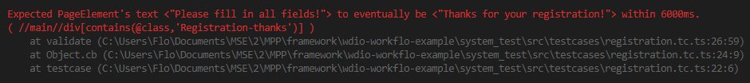
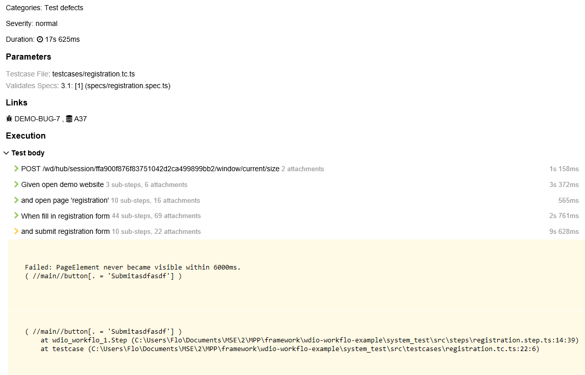

## Objective and Overview

Wdio-workflo's `testcase` function describe a sequence of states and state changes
in the GUI of your tested web application. From a user's perspective, testcases define all
interactions between a user and a system that take place in the context of a use case
to achieve a certain goal.

Similar to specs, testcases provide a `given` function to establish an initial state
and a `when` function to perform state changes. Unlike the `Given` and `When` functions
used within a `Story`, the `given` and `when` functions of a `testcase` expect a
`Step` function as parameter instead of a description written in natural language.

The main objective of a testcase is to validate the requirements of your tested application
which you formulated as stories and acceptance criteria in your spec files. To do so,
a testcase can invoke the `validate` function inside the `cb` callback function of each
`Step` to check the correctness of the GUI's state following the execution of a `Step`.

Related `testcase` functions are grouped together inside a `suite`.

## Location and Naming Convention

Testcase files are located in the `src/testcases` folder of your system test directory.
By convention, their filename always ends with `.tc.ts`.

## Example

In the [specs guide](specs.md), we defined some requirements for the registration form
of wdio-workflo's demo website.

Let us now write a testcase to validate the correct behavior of our application
if a user does not fill in all required form fields and tries to submit an incomplete registration!

In this case, an error message should be displayed which informs the
user that, in order for the registration process to succeed, all fields of the registration
form need to be filled in.

Let's call our testcase "submit incomplete registration". You can find its implementation
in the file `registration.tc.ts` located in the folder `src/testcases` of wdio-workflo-example
repository.

```typescript
import { pages } from '?/page_objects';
import { steps } from '?/steps';

suite("registration", {}, () => {
  testcase("submit incomplete registration", {}, () => {
    const formData: pages.RegistrationFormData = {
      username: 'johnDoe',
      email: 'john.doe@example.com',
      password: '1234',
    };
    const expectedFeedback = 'Please fill in all fields!';

    given(steps["open demo website"]())
    .and(steps["open page '%{page}'"]({
      args: { page: pages.registration }
    }))
    .when(steps["fill in registration form"]({
      args: { formData }
    }))
    .and(steps["submit registration form"]({
      cb: () => {
        validate({ "3.1": [2] }, () => {
          // server side validation - need to wait for feedback
          expectElement(pages.registration.feedbackField).toEventuallyHaveText(expectedFeedback);
        });
      }
    }));
  });
})
```

## Structure

As you can see from the example above, testcases are usually divided into two sections:

- The declaration and definition of all variables and input or expected data used during testcase execution
- The sequence of chained step invocations and validation callbacks

## Syntax

### suite

The `suite` function is used to group multiple related testcases together - e.g. all testcases
that validate the behavior of a website's registration process.

```typescript
suite("registration", {}, () => { /*your testcases go here*/ })
```

It has 3 parameters:

- The name of the suite which should be unique across all suites
- The metadata of the suite (reserved for future use - at the moment, this is always an empty object)
- The body function of the suite - you can define all related `testcase` functions within its scope

### testcase

The `testcase` function lets you define a testcase:

```typescript
testcase("submit incomplete registration", {}, () => { /*test data and sequence of steps*/ }
```

It has 3 parameters:

- The name of the testcase which should be unique within a suite
- The metadata of the testcase
- The body function of the testcase used to define test data and sequences of steps

#### Testcase metadata

You can define the following optional properties for the metadata parameter of a `testcase`
function:

- `severity` => How severe the implications of this testcases not passing would be
- `bugs` => If your testcase is affected by bugs which you track on e.g. JIRA, put the
bugs' JIRA keys here
- `testId` => If you manage your testcases in a test management system, put the managed test's key
here

### given

The `given` function is used to establish an initial state for your testcase:

```typescript
given(steps["open demo website"]())
```

It has 1 parameter:

- A `step` function which establishes the initial state of the testcase

*Please notice that the entries stored inside the `steps` object are step definitions
which are not the same as step functions. A step definition actually defines how
a step function should be created. Therefore, you need to execute a step definition
to receive a step function which can be passed to `given`. This is why we need to put parenthesis after our step definition: `steps["open demo website"]()`.*

To create a composite initial state, you can chain multiple `given` functions together
with the `and` function:

```typescript
given(steps["open demo website"]())
.and(steps["open page '%{page}'"]({
  args: { page: pages.registration }
}))
```

If a step requires you to define step arguments, you can provide them within the `args`
property of the `step` function's parameter object. Our step `"open page '%{page}'"`,
for example, requires us to define the `page` that should be opened.

### when

The `when` function performs state changes in your testcase and represents the
interactions between a user and a system. It always needs to follow a `given` function
or an `and` function of a composite initial state:

```typescript
// chained to a `given` function
given(steps["open demo website"]())
.when(steps["open framework link in footer"]()

// chained to the `and` function of a composite initial state
given(steps["open demo website"]())
.and(steps["open page '%{page}'"]({
  args: { page: pages.registration }
}))
.when(steps["fill in registration form"]({
  args: { formData }
}))
```

The `when` function has 1 parameter:

- A `step` function which changes the state of your tested application (via its GUI)

Usually, a testcase contains not only one, but many state changes. Therefore,
you can chain multiple `when` functions together using the `and` function:

```typescript
.when(steps["fill in registration form"]({
  args: { formData }
}))
.and(steps["submit registration form"]());
```

### validate

The `validate` function validates the specs which describe your application's requirements
by checking the correctness of the GUI state following the execution of a step.

It needs to be placed inside the `cb` callback function of a step:

```typescript
.and(steps["submit registration form"]({
  cb: () => {
    validate({ "3.1": [2] }, () => {
      expectElement(pages.registration.feedbackField).toEventuallyHaveText(expectedFeedback);
    });
  }
}));
```

The `validate` function has 2 parameters:

- The validation object that identifies which specs are to be validated
- The validation body function where you put expectation matchers to compare actual and expected results

The validation object's keys are the IDs of `Story` functions. Its values are arrays
of acceptance criteria IDs (the first parameters passed to the `Then` functions of the corresponding `Story`).

#### Result Status of validated Acceptance Criteria

You can place one or more expectation matchers inside a validation body function.
The result of each expectation matcher will be evaluated and only if the actual and
the expected value match for each of them, the result status of the acceptance criteria
defined within the validation object will be marked as `passed`.

If just a single expectation matcher fails (the actual value does not match the expected one),
the result status of the validated acceptance criteria will be marked as `failed`.

If a runtime error occurs within a validation body function, the result status
of the validated acceptance criteria will always be marked as `broken`.

If a runtime error occurred somewhere else inside a testcase and before the invocation of the validation body function, the result status of the validated acceptance criteria will be marked as `unvalidated`.

## Expectation Matchers

### Overview

Expectation matchers are used to compare an actual value with an expected value.
If both values match, the expectation matcher passes. If the two values differ,
the expectation matcher fails.

Expectation matchers always consist of two functions: an `expect` function and a
matcher function whose name usually starts with the word `to`:

```typescript
expect(actualUrl).toEqual(expectedUrl)
```

The `expect` function is passed the actual value and the matcher function is
passed the expected value.

### Default Expectation Matchers

Wdio-workflo supports all of the expectation matchers provided by the [Jasmine](https://jasmine.github.io/) test framework and the [jasmine-expect](https://www.npmjs.com/package/jasmine-expect) matcher library.

The most commonly used default expectation matchers are `toBe` to compare
the values of booleans or numbers and `toEqual` to compare the values of strings, arrays and objects. The `toContain` matcher checks if arrays contain a specific value.

### Custom Expectation Matchers

In addition, wdio-workflo also ships with a couple of custom expectation matchers
written specifically for page objects. It is recommended to use these custom
expectation matchers whenever possible to produce more meaningful validation failure messages.

There are five types of custom expectation matchers provided by wdio-workflo:

- `expectElement` takes an instance of the `PageElement` class
- `expectList` takes an instance of the `PageElementList` class
- `expectMap` takes an instance of the `PageElementMap` class
- `expectGroup` takes an instance of the `PageElementGroup` class
- `expectPage` takes an instance of the `Page` class

The `matcher` functions of these custom expectation matchers usually come
in two variants:

- One variant checks if a page object's attribute currently matches an expected value
- Another variant checks if a page object's attribute eventually matches an expected value

Both variants follow a naming convention: the "currently" matchers are named `toXXX`,
the "eventually" matchers are named `toEventuallyXXX`.

The "eventually" matchers remove the need to put explicit waiting statements
before a comparison and can optionally be passed a specific timeout in milliseconds:

```typescript
expectElement(submitButton).toEventuallyBeVisible({timeout: 2500})
```

If you do not explicitly specify a timeout value for "eventually" matchers,
the page object's default timeout value will be used.

The main advantage of wdio-workflo's custom expectation matchers is that they
provide more meaningful failure messages which include:

- the name of the page object
- a description of the kind of comparison which failed
- the XPath selector of a page element
- the timeout used for "eventually" matchers



## Testcases in Test Reports

### Testcases in Spec Reports

Wdio-workflo's [spec report](reporters.md#spec-reporter) shows the result status of each testcase, grouped by suites.

If you set the value of the `consoleLogLevel` config option in your `workflo.conf.ts` file to `"testcases"`, the name of each testcase will be displayed in the console when the testcase starts.
If you set the value of `consoleLogLevel` to `"steps"`, each step and its parameters will
additionally be written to the console window.

A list of all validation failures and runtime errors will be shown below each suite of testcases.
If you want to display validation failures and runtime errors immediately, set the
value of the `reportErrorsInstantly` config option to `true`.

### Testcases in Allure Reports

If you want to see more detailed information about your testcases,
you need to view their results in wdio-workflo's [Allure report](reporters.md#allure-reporter).

Open the "Behaviors" page in your Allure report, locate your suite within the "Testcases" group
and select a testcase. You will see a sequence of all executed steps on the right side of the page:



The details view also shows you which specs were validated by your testcase,
and, if any errors or validation failures ocurred, it will display
error stacktraces and screenshots of the GUI (if you expand the corresponding step)
at the time of failure.

Furthermore, the report displays the `severity` and the duration of the testcase, as well as the `testId` and the `bugs` defined in the metadata parameter of the `testcase` function as clickable links which take you to the corresponding JIRA issue page, for example.