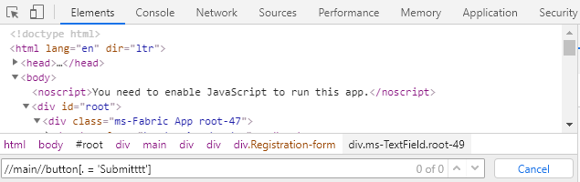

## Overview and Objectives

In order to locate the HTML elements which are mapped by page nodes on a website,
wdio-workflo requires you to pass XPath selectors to the constructors of page nodes
and to the factory methods of a `PageNodeStore` which create instances of these page nodes.X

To quote w3schools.com, [XPath](https://www.w3schools.com/xml/xpath_intro.asp) uses "path" like syntax to identify and navigate nodes in an XML document. Wait - an XML document?
Aren't websites written in HTML? Well, XML and HTML work in a similar way - they are
both [markup languages](https://www.lifewire.com/what-are-markup-languages-3468655)
which means that they use markup tags (e.g. `<p>`, `<div>`, ...) to describe the structure
of some data (in the case of XML) or of a website (in the case of HTML).
Therefore, XPath works with both XML and HTML.

The syntax used by XPath to locate nodes in an HTML file can become quite complex
if you need to select a node buried deep within the structure of a website.
For this reason, wdio-workflo ships with an XPath builder that allows you to
create XPath expressions using a set of predefined builder functions, so that you
don't have to remember all the syntax rules and to avoid errors in your XPath selectors.

However, wdio-workflo still allows you to write XPath expressions as "raw XPath strings".
You can find more information about the syntax of XPath [in this w3schools tutorial](https://www.w3schools.com/xml/xpath_syntax.asp).

*Please be aware that wdio-workflo only supports XPath selectors and no CSS selectors
because XPath selectors are more "flexible" than CSS selectors (eg. they support searching
for a parent element) and because the performance differences between the two are negligible in most cases.*

## Basic XPath Syntax

Although wdio-workflo's XPath builder spares you the need to know about each little
detail of the XPath syntax, it's still useful to know some basic syntax expressions
if you need to debug errors in your tests by examining the XPath selectors of page nodes.

### Child Nodes

Let's start with the concept of direct and indirect child nodes.
Direct child nodes are nodes that sit directly (one level) below their parent element
in the structure of a markup document. Indirect child nodes are nodes that appear
within the content of a parent element on any level of nesting.

#### Direct Child Nodes

XPath will always start its search for an HTML node at the root of the DOM.
Usually, the DOM root has only one direct child: the `html` node.
In XPath, direct child nodes can be selected using a slash `/` followed by the tag name
of the child node, e.g. `html`. So, to select the `<html>` tag of a website,
you can write the XPath expression `/html`.

To try this, you open the developer tools of your browser (for Google Chrome, by pressing F12),switch to the "Elements" tab, press Ctrl + F to open the DOM searchbar and enter `/html`.
The first HTML node matching the entered XPath expression in the website's DOM will be highlighted:


#### Indirect Child Nodes

Indirect child nodes are selected using a double-slash `//` followed by the tag
name of the child node, e.g. `div`. So, the XPath expression `//div` would select
all `<div>` tags of a website (but only the first match will be highlighted):


#### Concatenating Parent and Child Node Selectors

XPath allows you to concatenate the selector of a parent container and the selector of
any child node that sits inside this parent container - a concept that wdio-workflo
makes use of if you call a `PageNodeStore` factory method via the `$` accessor
of a `PageElement` or `PageElementList`:

```typescript
import { stores } from '?/page_objects';
import { Page, IPageOpts } from './Page';

export abstract class BasePage<
  Store extends stores.PageNodeStore
> extends Page<Store> {

  get container() {
    return this._store.Element(
      xpath('//main'),
    );
  }

  get heading() {
    return this.container.$.Element(
      xpath('//h1')
    );
  }

  /*...*/
}
```

In the code example above, the `heading` element is a child node of the `container`
element - this is reflected by the fact that the `Element()` factory method for
`heading` is invoked via the `$` store accessor of the `container` element.
Using the `$` accessor prepends the XPath selector of `container` to the XPath
selector of `heading`. The combined XPath selector for our `heading` element
that is eventually used to locate its corresponding HTML element on the website
is `"//main//h1"`.

### Constraints

In our examples above, our search for an HTML node always started from the
DOM root element of a website. However, there are usually a lot of the same
HTML tags like `<div>` on a website. If we do not want to select the first
`<div>`, but a `<div>` buried deep within the structure of a website, we need
to place additional constraints within our XPath expression.

Constraints are defined by appending double square brackets `[]` to your XPath
expression. Inside these brackets, we can define additional conditions that
an HTML node needs to fulfil in order to be selected.

One very basic use case is to select the n-th element of a kind. This means that
we want to select the n-th tag of a series of equal tags on the same nesting level.
To achieve this, we can simply put a number between the square brackets.
This number indicates the index of the corresponding page node on the same hierarchy level,
starting at 1.

To select the second `<div>` tag within the same hierarchy level, we would write
`//div[2]`:


Other types of conditions for a constraint are explained in the following sections
of this chapter.

### Attributes

One of the most common ways to constrain XPath expressions is to define values
of HTML attributes.

Each HTML node has a set of attributes, depending on the actual type
of the HTML node (e.g. `<div>` or `<input>`). Very common HTML attributes often
used to restrict XPath expressions are the `id` and the `class` attributes.

XPath allows us to define HTML attributes via the `@` character. The `@` character
needs to be placed inside a "restriction", which is depicted with square brackets `[]`.
To set the value of the HTML attribute, we put a `=""` behind the `@` character
and write the desired value between the quotation mark `""` characters.

So, if we wanted to select the HTML node `<div id="root">`, we would need to
write `//div[@id="root"]`:


### Text Content

Another common way to constrain XPath expressions is to define the text contained
within an HTML element.

We can refer to the text contained within an HTML element by using the dot `.` character.
The text content does not necessarily need to be located on the level directly below
the selected HTML tag - the `.` character will also include text nested multiple
levels below the selected HTML tag.

On the registration page of wdio-workflo's demo website, for example, there is
a button with the text "Submit". To select this button, we would need to write
`//button[.="Submit"]`. This would work, even though the text "Submit" is actually
located within a `<div>` tag 3 levels below the `<button>` element:


### contains()

It is common to select an HTML node by constraining the value of its CSS class name.
However, many HTML nodes do not have one, but many different CSS classes that all
occur within their CSS class attribute.

In these cases, we can use XPath's `contains()` function which checks if a
string (e.g. the value of the HTML `class` attribute) contains a certain substring.

The `class` attribute of a `<label>` tag, for example, could have the value
`"ms-Label ms-Dropdown-label label-80"`. We could select this label node
by checking if its `class` attribute contains the substring `"ms-Dropdown-label"`
by writing `//label[contains(@class, "ms-Dropdown-label")]`:


### Multiple Constraints

We can also combine multiple constraints for a single HTML node by simply
appending the constraints to the XPath expressions selecting the HTML node,
each constraint surrounded by square brackets.

If we wanted to select a `<div>` HTML node, for example, whose `id` attribute
has the value "Dropdown10" and whose `role` attribute has the value "listbox",
we would write `//div[@id="Dropdown10"][@role="listbox"]`:


### Has Child

Often you need to constrain the XPath expression for locating an HTML node by
the attribute values of one of its child nodes. However, you want to select the parent HTML
node and not the child node whose attributes or text is used to define the constraint.

You can refer to child nodes without selecting them by putting the XPath selector
of the child node within the constraint brackets of the parent node.
At the start of the child node's XPath selector, you can refer to the current node
by writing `.`.

The registration page of wdio-workflo's demo website contains a couple of textfields.
Each textfield consists of a `<label>` and an `<input>` element and the textfield's
root element is marked by the CSS class "ms-TextField".
If we wanted to select the textfield whose label has the text "Username",
we'd write `//div[contains(@class, "ms-TextField")][.//label[.="Username"]]`:


## Usage of XPath Builder

### `xpath` Function

Wdio-workflo's XPath builder is available via the global `xpath` function.
This function takes the string of an XPath expression as parameter and returns
a builder object offering many different "XPath modification functions".
These XPath modification functions can be used to alter the original XPath
string.

Usually, you would only pass the tag name of the HTML element, prepended by either
`/` if it is a direct child or `//` if it is an indirect child node of its parent node,
to the `xpath` function. So, for example, to select the first match of a `<header>`
HTML element, we would write `xpath('//header')`.

### XPath Modification Functions

We can then chain an arbitrary number of XPath modification functions to the
result of our `xpath` function. Most of these XPath modification functions
add constraints to the original XPath selector.

#### Constraint Functions

The most common constraint XPath modification functions are:

- `.id("myId")`
- `.class("myCssClass")`
- `.attribute("someHTMLAttribute", "valueOfTheAttribute")`
- `.text("myText")`

These constraint XPath modification functions also exist in a `notXXX`,
`xxxContains` and `notXXXContains` variant. So, for the `id()` function, there are:

- `notId("myId")` to select nodes whose HTML `id` attribute does not equal "myId"
- `idContains("myId")` to select nodes whose `id` contains the string "myId"
- `notIdContains("myId")` to select nodes whose `id` does not contain the string "myId"

Some other constraint XPath modification functions are:

- `checked()` to constrain HTML element to nodes which have an HTML `checked` attribute
- `disabled()` to check if an HTML element is disabled
- `index(5)` to constrain HTML elements by their index of occurrence across all levels of nesting
- `levelIndex(2)` to constrain HTML elements by their index of occurrence within the some level
of nesting
- `name("myName")` to constrain HTML elements by their HTML `name` attribute
- `selected` to constrain HTML elements to nodes which have an HTML `selected` attribute
- `type("myType")` to constrain HTML elements by their HTML `type` attribute

append, constraint


hasChild

child

#### Example of a complex XPath Expression

To give you an idea of how using wdio-workflo's XPath builder can help you
to write complex XPath expressions, the following code shows the same XPath
expression written as a "normal" string and created with wdio-workflo's
`xpath` builder function:

```typescript

```

#### Building and Resetting the Builder's XPath Expression

If you invoke the `build()` method on an XPath builder, the XPath expression
created by the builder will be returned as a string.

You can also clear the builder's current XPath expression by invoking the
builder's `reset()` method.

Usually, you don't have to call these two methods manually because the
factory methods of a `PageNodeStore` automatically invoke `build()` and `reset()`.
Therefore, each factory method usually accepts an XPath expression either as a
normal string or as an instance of wdio-workflo's XPath builder.

However, if you want to store an XPath expression created by wdio-workflo's
XPath builder in a variable, you need to invoke `build()` yourself.

## "Debugging" XPath Selectors

Sometimes your tests might fail because a page node could not be located using
the given XPath selector. This can happen if the HTML structure of the tested
web application has changed or if your XPath expression simply isn't correct.

Wdio-workflo usually displays the XPath selector of a page node in error messages:


You can then simply copy the XPath selector, open the developer tools of your browser,
switch to the `Elements` tab (in Google Chrome), press Ctrl + F to open the DOM
search field and paste the XPath selector into the search field to check if
the element can be located on the website:



Another way to obtain the XPath selector of a page node is to invoke the
`getSelector()` method of the `PageElement`, `PageElementList` and `PageElementMap` classes.

If I cannot obtain the XPath selector of a page node from an error message when debugging a broken testcase, I usually just output the page node's XPath selector to the console
using `getSelector()` and then copy it from there:

```typescript
import { pages } from '?/page_objects';

console.log(pages.registration.submitButton.getSelector())
```

For more information about debugging in wdio-workflo, visit the [Debugging Guide](debugging.md).